# AI Operating Model Blueprint — Execution Document

**Version:** 1.0
**Date:** 2026-05-24
**Audience:** Head of AI · Group Head · McKinsey implementation team · Anthropic Federal Practice
**Classification:** UNCLASSIFIED // FOUO (architecture only; populated instances inherit program classification)
**Co-authored by:** Group Head + McKinsey Public Sector AI · Anthropic Federal PE Practice

---

## EXECUTIVE SUMMARY

This blueprint specifies the AI operating model for a 400-FTE federal policy and program office running 20 active programs with 10 to stand up over the next 12–18 months. It is an execution document, not a strategy deck. Every recommendation names the system, the owner, the reference pattern inherited, the capability plane consumed, the ATO/compliance path, the cost envelope, and the 90-day success metric.

**The operating model rests on a two-axis architecture:** six vertical operating layers (L1 Executive Intelligence · L2 Program Operations · L3 Span Functions · L4 Cross-Program Intelligence · L5 Inter-Agency Liaison · L6 Performance & Learning) crossed by seven horizontal capability planes (P1 Live Operational Dashboard · P2 Universal Action Flow · P3 External Intelligence Ingestion · P4 Context Architecture · P5 Capture Surface · P6 Synthesis & Briefing · P7 Knowledge Graph). The 42 layer-plane intersections form the contract surface of the system.

**Four cross-cutting capabilities are mandatory and pervasive:**

1. **Signal quality gate** at capture. Every item triaged on relevance, actionability, novelty, source credibility before it touches the canonical state. Low-signal items archived, not surfaced.
2. **Hierarchical synthesis.** Same canonical state synthesized to four resolutions — staff, program manager, DR, group head — by model-appropriate passes (Haiku, Sonnet, Opus). Detail stays where it can be acted on; signal rises to where decisions get made.
3. **Cross-program learning engine.** Per-program durable knowledge (charter, status, log, learnings) accumulates locally; patterns that generalize graduate to org-level best practices and the Program-in-a-Box kit. Peer learnings auto-surfaced when structurally similar programs face the same situation.
4. **Tiered visibility.** Three-layer enforcement: Claude Enterprise access control, compile-time role-tier state files, per-tier CLAUDE.md system prompt constraints. Each layer is independent; all three are required.

**~70% of the production code inherits from three proven reference repositories** (Private-Yoni-Dashboard, Invite-Chief-of-Staff, Private-Yoni-Config). Every leverage call cites the pattern by stable ID (HI1, G2, G3, AA1, EP1, U2, PA1, CF1, CC1, LA1, TL1/TL2, NM1, etc.). Net-new components are limited to federal-specific extensions (classification-aware compile, PIV/CAC SSO gating, ATO inheritance path, role-tier state projection).

**Critical path runs through ATO.** Authority to Operate is the single most consequential constraint and the most underestimated. Phase 0 (Days -90 to 0) is ATO posture, FedRAMP path, ISSO embedment. No design work proceeds without it. The 90-day post-mortem from comparable rollouts shows ATO consuming 60+ days of the Head of AI's time when it isn't pre-staged.

**Investment envelope: $8.4M Year 1, $11.2M Year 2.** Headcount builds to 14 FTE by Month 12 (4 AI engineering, 3 program implementation, 2 knowledge engineering, 1 external intelligence lead, 2 ATO/compliance, 1 governance/change management, 1 AI lead). Tech and contractor spend front-loaded in Months 1–6.

**90-day success criteria, non-negotiable:**
- Group head + 6 DRs receive daily synthesized brief by 07:45 ET (Opus pass)
- 3 lighthouse programs live on Program-in-a-Box with all canonical files populated
- Inter-agency commitment tracker operational with two-phase confirmation cycle
- External intelligence Tier 1 feeds (Federal Register, OMB, GAO, regulations.gov) running daily with readthrough engine matching to programs
- Signal quality gate in audit mode for 30 days, then enforcement
- Union MOU executed before any span function automation demo
- Knowledge engineering sprint complete: every active program has populated charter.md, status.md, CLAUDE.md, stakeholders.md

The remainder of this document specifies each of the 18 sections in the six-part memo structure. Appendices contain the master leverage-vs-build table, critical path, pattern inheritance map, 42-cell layer-plane matrix, canonical state schema, open questions register, action items, and outstanding requests.

---

# SECTION 1 — Layered Operating Model Architecture (Two-Axis)

## 1. The Core Recommendation

Adopt a two-axis architecture: **six vertical operating layers** describing who does what work, crossed by **seven horizontal capability planes** describing the shared infrastructure every layer consumes. The 42 intersections are not abstractions — each is a specific contract describing what data flows in, what flows out, what shared state is touched, and which registry mediates the exchange. This architecture is the structural commitment. Everything else in this blueprint refines it.

The architecture is binding for one reason: it forces every recommendation to specify which layer is acting and which plane is providing the capability. "Build a dashboard" is not an actionable recommendation. "L1 Executive Intelligence consumes P1 Live Operational Dashboard via the role-tier state projection (compile-time mask)" is. The two-axis model makes ambiguity expensive, which is exactly what's needed at 400-FTE scale where ambiguity at design time becomes silos at run time.

## 2. Design Detail

**The six operating layers:**

| ID | Layer | Primary user | Workflows |
|---|---|---|---|
| L1 | Executive Intelligence | Group head + 6 DRs | Daily synthesized brief; portfolio rollup; decisions inbox; escalation routing |
| L2 | Program Operations | Program directors + program teams | Per-program intake, status, deliverable production, action flow |
| L3 | Span Functions | Legal, finance, perf eval, ops, comms | Domain workflows (FOIA, contract review, budget exec, comms clearance) |
| L4 | Cross-Program Intelligence | Group head COS, AI Lead | Portfolio analytics, best practice extraction, anomaly detection, cross-program coordination |
| L5 | Inter-Agency Liaison | Liaison leads, designated COS-level staff | Commitment capture, two-phase confirmation cycle, stale-item surfacing, PC/DC/IPC integration |
| L6 | Performance & Learning | Performance eval director, program leads | Telemetry, continuous evaluation, evidence vault, learning ledger, BP promotion |

**The seven capability planes:**

| ID | Plane | Reference pattern inherited | Production substrate |
|---|---|---|---|
| P1 | Live Operational Dashboard | cos-dashboard-server.py + HI1 served-HTML contract | Flask server on FedRAMP gov cloud, role-tier state projection |
| P2 | Universal Action Flow | dash-state-hook + intel_capture + G3 owner whitelist + AA1 tombstones + PA1 past-due classification | Action extraction → routing → 4-layer persistence |
| P3 | External Intelligence Ingestion | podcast/research pipelines + U2 readthrough cross-reference | Feed taxonomy (T1–T4) → triage → readthrough → digest |
| P4 | Context Architecture | CLAUDE.md hierarchy + LEARNINGS-LEDGER.yaml + drive-docs.yaml + CONTEXT-MANIFEST.yaml + CM1 lookup | Per-program durable knowledge files; org-level learning ledger; graduation rules |
| P5 | Capture Surface | Otter + call recorder + Gmail Mini + file router + verbal-update four-layer persistence | Every input modality wired in with signal quality gate at ingress |
| P6 | Synthesis & Briefing | cos-personal-briefing skill + six-section memo standard | Hierarchical synthesis: Haiku per program, Sonnet per DR, Opus per group head |
| P7 | Knowledge Graph | entity_graph_build + knowledge_api + people CRM + alias directory + practice patterns | People/agencies/programs/authorities/commitments graph; similarity map; readthrough substrate |

**The 42-cell layer × plane matrix** is enumerated in Appendix D. Each cell carries: `data_in` (what arrives), `data_out` (what is produced), `shared_state` (which canonical state field is touched), `shared_registry` (which whitelist/alias/index mediates).

## 3. Leverage-vs-Build Calls

| Item | Decision | Pattern inherited | Plane consumed | Why |
|---|---|---|---|---|
| Two-axis architecture itself | **build** | N/A (extension) | All | Net-new mental model; no prior pattern at federal scale |
| Layer-plane matrix cell discipline | **leverage** | G2 schema validation | All | Same "required fields per cell" enforcement as G2 |
| Pattern ID stable references | **leverage** | LEARNINGS-LEDGER rule ID scheme | P4 | Direct port; same hash + human-readable ID format |

## 4. Open Questions

- Which existing committee (CAIO council, AI governance board, IT steering) does L4 cross-program intelligence report to? Affects authority and escalation paths.
- Do classified programs require a parallel L1–L6 stack (separate canonical state, separate dashboard server) or can role-tier projection handle CUI/SBU sufficiently? Discussion in Section 13.
- L5 inter-agency liaison: does this layer have authority to commit on the agency's behalf, or is it strictly capture-and-route? Affects the two-phase confirmation cycle design.

## 5. Dependencies

- Sections 3 (Org Structure), 9 (Governance), 10 (Sequencing) all reference this architecture
- Existing agency org chart (current state of who maps to L1/L2/L3 roles)
- Section 13 (P1) and 17 (P5+P6) detail the highest-touch planes first

## 6. Success Metric (90-day)

By Day 90, every active program is mapped to a specific L1/L2/L3 owner; every dashboard surface produced cites which layer it serves and which planes it consumes; the 42-cell matrix is populated for the three lighthouse programs (i.e., each cell has been touched by at least one real artifact). No surface ships without its cell contract validated.

---

# SECTION 2 — Leverage-vs-Build Decision Matrix

## 1. The Core Recommendation

**Default to leverage. Every "build" decision must answer the question: "Why is X not sufficient?" where X is, in order: (1) a Claude Code native primitive (subagent, skill, hook, scheduled task, MCP server), (2) an existing reference pattern from the three repos, (3) an existing agency system, (4) a commercial off-the-shelf option, (5) a procurement vehicle already on a GWA/GSA schedule. Build only when all five have been ruled out with documented reasoning, and even then prefer hybrid (build the thin layer that connects existing systems) over greenfield.**

The discipline matters because the federal procurement and ATO cycle punishes "build" decisions disproportionately. A net-new system requires its own ATO (12–18 months), its own contract vehicle (6 months minimum), its own training and adoption (3–6 months). A leveraged system inherits all three. The cost differential is roughly 4–6x in time and 3–5x in dollars over a 24-month window.

## 2. Design Detail

The full leverage-vs-build matrix is in Appendix A. Below is the decision framework applied to every recommendation in this blueprint:

**Decision tree per capability:**

1. **Is there a Claude Code primitive?** (subagent, skill, hook, scheduled task, MCP server) → use it. Cite the primitive.
2. **Is there a reference pattern in the three repos?** (cos-dashboard-server.py, intel_capture.py, knowledge_api.py, entity_graph_build.py, etc.) → fork and adapt. Cite the source path and the pattern ID inherited.
3. **Is there an existing agency system?** (ServiceNow, SharePoint, agency DM, case management, FOIAonline, MAX.gov) → integrate via MCP. Cite the system and the integration mechanism.
4. **Is there a FedRAMP-cleared commercial option?** (Tableau Gov, Power BI Gov, Salesforce Gov, Microsoft 365 Gov) → procure. Cite the option and the existing contract vehicle.
5. **Is there a procurement vehicle on schedule?** (GWA, GSA schedule, OASIS+, CIO-SP4) → leverage the vehicle. Cite the vehicle.
6. **None of the above?** → build, with explicit justification in the section's leverage-vs-build calls table.

**Forbidden categories of "build":**

- Re-implementing patterns the reference repos already prove (e.g., a new action extraction pipeline when intel_capture already works)
- Custom dashboards when role-tier projection of canonical state suffices
- Parallel data stores for the same canonical fact (violates "one canonical state" principle)
- Skill libraries containing program-specific data (tenant leak — violates TL1/TL2)
- External intelligence ingestion without readthrough matching (violates U2)

## 3. Leverage-vs-Build Calls

The full table is Appendix A. Headline summary:

| Capability area | Leverage | Build | Procure | Hybrid |
|---|---|---|---|---|
| Dashboard server | ✅ (fork cos-dashboard-server.py) | | | |
| Action flow (P2) | ✅ (fork intel_capture + dash-state-hook) | | | |
| Knowledge graph (P7) | ✅ (fork entity_graph_build) | | | |
| External intelligence (P3) | ✅ (fork cross_reference_briefing.py) | Federal feed adapters | | |
| Capture surface (P5) | ✅ (Otter, Gmail Mini patterns) | Classification-aware splitter | | |
| Role-tier state projection | | ✅ | | |
| PIV/CAC SSO | | | ✅ (existing tenant) | |
| FedRAMP infra | | | ✅ (GovCloud) | |
| FOIA workflow | | | | ✅ (FOIAonline + Claude skill layer) |
| Contract writing | | | | ✅ (existing contract writing system + Claude skill) |
| Budget execution | | | | ✅ (existing budget system + Claude skill) |

## 4. Open Questions

- Which procurement vehicle (CIO-SP4, OASIS+, GSA MAS, agency BPA) is fastest for the Claude Enterprise expansion needed? Affects critical path.
- Does the existing FedRAMP Anthropic tenant have IL4/IL5 coverage, or only commercial? Determines whether classified programs can use the system at all.
- Which agency span functions (legal, finance, etc.) have existing FedRAMP-cleared tools the AI workflows should sit on top of, vs. systems that need to be replaced or augmented?

## 5. Dependencies

- Current-state inventory (Section 10 Phase 0) populates the matrix completely
- Section 11 (Investment) costs follow from leverage-vs-build choices
- Section 9 (Governance) ratifies the matrix and the ongoing approval process for new builds

## 6. Success Metric (90-day)

Zero new "build" decisions ratified without documented why-not-leverage reasoning. The leverage-vs-build matrix is a living document, updated weekly, reviewed monthly by the AI governance committee. By Day 90, the matrix has at least 75 capability rows and the build:leverage ratio is no worse than 1:4.

---

# SECTION 3 — Org Structure for the AI Function

## 1. The Core Recommendation

**The AI function is a 14-FTE team by Month 12, led by a Head of AI at SES-equivalent authority, reporting to the group head with a dotted-line coordination relationship to the CIO, CDO, CISO, and CAIO. Authority is non-negotiable: the Head of AI must be able to direct cross-cutting AI decisions without routing through any of those four offices for approval, while maintaining transparent coordination with each. A GS-15 detail with no independent budget will fail in committee within 60 days — this is the single most important org-structural lesson from comparable rollouts.**

The team is organized in five functions: AI Engineering (4), Program Implementation Support (3), Knowledge Engineering (2), External Intelligence (1), ATO/Compliance (2), Governance & Change Management (1), Head of AI (1). The structure prioritizes adoption and durability over capability sprawl: every role connects to a measurable outcome on the dashboard, and no role exists purely for "innovation" or "AI strategy" with no operational deliverable.

## 2. Design Detail

**Team composition by function:**

| Function | FTE | Roles | Primary responsibility |
|---|---|---|---|
| Head of AI | 1 | SES-equivalent or strong SES sponsorship | Decision authority, governance chair, budget owner, executive interface |
| AI Engineering | 4 | Tech Lead (1), Senior Engineers (2), Engineer (1) | Build/fork dashboard, compile pipeline, capture surface, synthesis layer |
| Program Implementation Support | 3 | Program AI Specialists | Embedded with cohorts during onboarding; 2-week intensive per lighthouse |
| Knowledge Engineering | 2 | Knowledge Engineer, Graph Engineer | P7 knowledge graph, P4 context architecture, similarity map, BP library |
| External Intelligence | 1 | External Intel Lead | P3 feed taxonomy, readthrough engine, stakeholder intelligence layer |
| ATO/Compliance | 2 | Embedded ISSO, Compliance Analyst | ATO inheritance, FedRAMP coordination, classification controls, audit trail |
| Governance & Change Management | 1 | Change Manager | Training, adoption metrics, union/labor relations interface, cohort planning |

**Talent sources** (ranked by speed and quality):

1. **IPAs and details from agencies with prior AI deployment** (DOE OEDF, GSA TTS, USDS, NSF) — 30–60 days to onboard, high quality, time-limited
2. **Direct hire under Title 38 / DHA / NSPM-33 streamlined authorities** if available — 60–90 days
3. **Contractor support** for surge capacity, particularly engineering — 30–45 days; transition to FTE within 18 months
4. **Detailees from internal program offices** — fastest (15–30 days) but creates capacity gaps in their home programs

**Interfaces (decision rights):**

| With | Decision authority |
|---|---|
| Group head | Direct report; Head of AI has weekly 30-min standing; quarterly review |
| 6 DRs | Coordination authority; Head of AI can require DR engagement on cross-program decisions |
| CIO | Coordination; Head of AI requires CIO sign-off on infrastructure changes but holds AI architecture authority |
| CISO/ISSO | Embedded ISSO on team; Head of AI holds operational authority within ATO boundaries |
| CDO | Coordination on data governance; Head of AI holds AI usage authority within data policy |
| CAIO | Coordination on agency AI policy compliance; Head of AI implements agency CAIO guidance but holds blueprint execution authority |
| GC | Required coordination on FOIA, union, IP, ethics; weekly standing meeting |

## 3. Leverage-vs-Build Calls

| Item | Decision | Pattern inherited | Plane | Why |
|---|---|---|---|---|
| SES-equivalent authority | **build** (org change) | N/A | All | Authority is the prerequisite, not the output |
| Embedded ISSO model | **leverage** | DOE OEDF model | All | Proven at peer agency; reduces ATO cycle by 4–6 months |
| Cohort-based program support | **build** | N/A (extension of 2-week onboarding pattern) | L2 | Required for 14-day to live target (Section 4) |
| IPA/detail talent source | **leverage** | Existing OPM authority | N/A | Fastest path to operating capability |

## 4. Open Questions

- Does the agency have unused Title 38, DHA, or NSPM-33 streamlined hiring authority applicable to AI roles? Affects 60-day hiring outcomes.
- Does the CAIO accept the proposed coordination model, or do they require a different reporting relationship?
- Can the Head of AI role be filled internally from a known SES candidate, or does it require open competition? Internal fill is 90 days faster.
- What is the existing labor relations posture? Are union representatives already engaged on AI workforce questions? Affects Section 8 and 9 sequencing.

## 5. Dependencies

- Section 9 (Governance) — the Head of AI chairs the AI governance committee
- Section 10 (Sequencing) — talent buildup gates Phase 1 and Phase 2 milestones
- Section 11 (Investment) — headcount cost is ~55% of Year 1 budget

## 6. Success Metric (90-day)

By Day 90: Head of AI in seat with confirmed authority; 8 of 14 FTE positions filled or in active onboarding; weekly governance committee meeting with full attendance from CIO/CISO/CDO/CAIO/GC; zero escalations to group head for decisions within the Head of AI's authority scope.

---

# SECTION 4 — Per-Program Standard Kit ("Program-in-a-Box")

## 1. The Core Recommendation

**Every program — existing or net-new — receives an identical standard kit on day one: a fixed set of canonical files in a fixed directory structure, a populated CLAUDE.md, a defined skill set, a wired-in MCP integration profile, a per-program dashboard surface, and a connection to the org-level knowledge graph. The kit is what makes 20 programs run on the same operating system rather than 20 bespoke configurations. The target is 30 days from program identification to "first useful output" on the kit (not 14 days — 14 days was wrong; comparable rollouts averaged 34).**

The kit's most important property is **durable knowledge accumulation**. Each program's directory grows in a controlled way: status updates rewrite (don't append), action logs append (with quarterly roll-off), learnings accumulate (with promotion rules to org-level ledger), context manifests evolve (edit-in-place). This is the mechanism by which institutional memory stops walking out the door at retirement. It's also the mechanism by which Program 21 starts smarter than Program 1 because every prior program's lessons are in the kit.

## 2. Design Detail

**Per-program directory structure** (modeled on `~/dashboards/data/deals/<slug>/` G4 pattern, scaled):

```
data/programs/<program_slug>/
├── charter.md           # Immutable framing: authority, scope, intent, success criteria
├── status.md            # Rolling state, ≤8KB hard cap, complete rewrites only
├── CLAUDE.md            # Program-specific Claude instructions, context manifest, registries
├── actions.md           # Live action register (P2 sink)
├── log.json             # Append-only event log, 90-day rolling window
├── stakeholders.md      # People CRM extract scoped to this program
├── learnings.md         # Program-specific patterns and lessons, ≤10KB cap
├── archive/             # Graduated content
│   ├── log-2026-Q1.json
│   ├── log-2026-Q2.json
│   └── learnings-graduated-2026-05.md
└── synthesis/
    ├── morning-brief-latest.md   # Haiku output, regenerated 06:30 daily
    └── weekly-rollup-latest.md   # Sonnet output, regenerated Friday 16:00
```

**File-by-file lifecycle:**

| File | Size cap | Cadence | Discipline | Promotion rule |
|---|---|---|---|---|
| `charter.md` | ~5KB | Quarterly review; otherwise locked | Editorial discipline; signed by program director | None — immutable except for amendment |
| `status.md` | **8KB hard** | Daily rewrite at 06:30 (Haiku synthesis from log.json) | Complete rewrites, no patches (deal-status discipline from existing pattern) | None — current state only |
| `CLAUDE.md` | ~12KB | Weekly review; edit-in-place (EP1) | Includes context manifest, owner whitelist for this program, skill set, classification | When changes generalize, promote to global CLAUDE.md template |
| `actions.md` | Unbounded | Real-time (P2 writes) | AA1 tombstones + PA1 past-due classification + G3 owner whitelist enforcement | None — actions resolve, not graduate |
| `log.json` | Append-only, 90-day rolling | Real-time append | V1 per-deal log structure; AP1 alias precision; parent_id propagation | After 90 days → `archive/log-YYYY-Q?.json` (still queryable, not loaded) |
| `stakeholders.md` | Auto-managed | Daily refresh from P7 knowledge graph | Two-way sync with graph; alias resolution | Cross-program stakeholders auto-flagged for org-level CRM |
| `learnings.md` | **10KB cap** | Weekly review; oldest entries graduate | Rule ID schema (program-prefixed); recurrence count | When learning recurs in 3+ programs → graduate to global learning ledger with stable rule ID |

**The Program-in-a-Box deployment sequence (30 days):**

| Day | Activity | Owner | Output |
|---|---|---|---|
| Day 1 | Intake interview (30 min, Claude Code subagent asks 12 questions) | Program AI Specialist | Draft CLAUDE.md, draft charter.md |
| Day 2 | Program director reviews and signs charter.md | Program director + AI Specialist | Signed charter.md committed |
| Day 3–5 | Knowledge engineer runs structured interviews with program staff | Knowledge Engineer | Populated stakeholders.md, initial learnings.md |
| Day 5 | Skill set deployed (program-appropriate skills from global library) | AI Engineer | CLAUDE.md skill manifest finalized |
| Day 6–10 | MCP integrations wired (program's specific data sources) | AI Engineer | Integration profile committed |
| Day 10 | Dashboard surface live for program team | AI Engineer | `/program/<slug>` route accessible |
| Day 11–25 | Capture surface ingestion live; daily morning brief generated | Program AI Specialist | First Haiku synthesis pass |
| Day 25–30 | Cohort review with Head of AI; gate to "live" status | Head of AI + Program Director | Program marked `status: live` in registry |

**Skill set deployed per program** (modular — programs get only what applies):

- **Universal (all programs):** capture-trigger, action-extract, status-rewrite, brief-synthesize, commitment-track, intel-readthrough
- **Policy programs:** authority-traceability-check, draft-implementing-guidance, comment-triage, comparative-design-memo
- **Grant programs:** application-readthrough, eligibility-check, award-tracker, post-award-monitoring
- **Loan/credit programs:** credit-memo-draft, portfolio-stress-test, recipient-monitoring
- **Coordination programs:** ipc-paper-draft, commitment-confirmation-cycle, stakeholder-pulse
- **Stand-up programs (pre-launch):** charter-draft, stakeholder-mapping, launch-checklist, BP-application

## 3. Leverage-vs-Build Calls

| Item | Decision | Pattern inherited | Plane | Why |
|---|---|---|---|---|
| Directory structure | **leverage** | G4 per-deal canonical files | P4 | Direct port; same compile expectations |
| status.md 8KB rewrite discipline | **leverage** | deal-status doc discipline | P6 | Proven; produces readable executive content |
| log.json append-only 90-day rolling | **leverage** | Per-deal log + V1 + append-only roll-off | P5, P4 | Direct port |
| CLAUDE.md hierarchy | **leverage** | Global/project/per-deal CLAUDE.md | P4 | Existing pattern; same context manifest mechanism |
| Skill set library | **leverage** | Existing skills + new federal-specific skills | All | Modular, composable |
| Intake interview subagent | **build** (subagent) | Claude Code subagent primitive | P5 | Net-new but uses native primitive (CC1) |
| Knowledge engineer role | **build** (org) | N/A | P4, P7 | Required for bootstrap — see Section 16 |
| MCP integration profile | **hybrid** | Existing MCP servers + program-specific | All | Reuse where possible |

## 4. Open Questions

- Which programs get the "stand-up" kit variant vs. "active execution" vs. "mature" variant? Need decision criteria, not just self-selection.
- How are program-specific classification handling rules encoded in CLAUDE.md? Need a template that prevents CUI from flowing through unclassified pipelines.
- What is the program-to-DR routing for graduated learnings? Does the program director approve, or does the AI Lead?

## 5. Dependencies

- Section 3 (Org Structure) — Program AI Specialists and Knowledge Engineers are prerequisites
- Section 16 (Context Architecture & Knowledge Graph) — graduation rules and global ledger live there
- Section 17 (Capture Surface & Synthesis) — log.json populated by P5, status.md generated by P6
- Section 5 (Launch Playbook) — uses the kit as its execution substrate

## 6. Success Metric (90-day)

By Day 90: 3 lighthouse programs fully on the kit with all canonical files populated and within size caps; status.md generated daily on schedule for each; first 5 graduated learnings in the global learning ledger; the Day-30 "first useful output" target met by all 3.

---

# SECTION 5 — New Program Launch Playbook

## 1. The Core Recommendation

**The New Program Launch Playbook is a templated, accountable checklist applied to every program that stands up over the next 12–18 months. It is not a suggestion document. Every item carries an owner, a due date, and a routing destination on the dashboard. Items not closed on schedule surface to the Head of AI's queue. The playbook compresses what historically took 6–9 months of ad hoc setup into 60–90 days of structured execution, while ensuring no new program launches without inheriting the lessons of the 20 already running.**

The playbook is the application of the Program-in-a-Box kit to a program that doesn't yet exist. It starts before the program has staff, runs through stand-up, and ends when the program graduates from "new" to "active" status. The single most important property: it forces the program to start with the best-practice library in scope from day one, rather than discovering 18 months later that other programs had already solved their problems.

## 2. Design Detail

**Three phases, four gates:**

**Phase 1 — Pre-Launch (Day -60 to Day 0):**

| Item | Owner | Due | Routes to |
|---|---|---|---|
| Authority memo and statutory basis documented | Program Director designate | Day -60 | charter.md draft |
| Cross-program structural similarity analysis run | Knowledge Engineer | Day -55 | Identifies 3–5 nearest programs |
| Applicable BPs from library reviewed | Program Director + AI Lead | Day -50 | Program kit gets pre-loaded BP set |
| Charter drafted incorporating BPs | Program Director + AI Specialist | Day -45 | charter.md v1 |
| Stakeholder map (initial) | Knowledge Engineer | Day -40 | stakeholders.md v1 |
| ATO inheritance path confirmed | ISSO | Day -30 | Compliance record |
| Initial staffing complete (≥50%) | HR + Program Director | Day -15 | Owner whitelist updated |

**Gate 1 (Day 0):** Pre-Launch Review — Head of AI + Program Director + applicable DR sign off. Program enters Phase 2.

**Phase 2 — Stand-Up (Day 0 to Day 30):**

This phase follows the Program-in-a-Box 30-day deployment sequence exactly (Section 4). Every checklist item from that sequence applies. Additional items unique to new programs:

| Item | Owner | Due | Routes to |
|---|---|---|---|
| First stakeholder outreach completed | Program Director | Day 5 | log.json entry |
| First inter-agency commitment registered | Program Director | Day 15 | Commitment tracker (Section 6) |
| Anti-pattern review with similar programs | AI Specialist + 2 peer Program Directors | Day 20 | learnings.md seed |
| Initial Performance Intelligence telemetry live | Performance Eval | Day 25 | L6 dashboard |

**Gate 2 (Day 30):** Stand-Up Review — first useful output demonstrated; capture surface operational; first morning brief generated. Program enters Phase 3.

**Phase 3 — Early Live (Day 30 to Day 90):**

| Item | Owner | Due | Routes to |
|---|---|---|---|
| 6-week cross-program retrospective | Program Director + AI Specialist | Day 45 | Cross-program patterns |
| External intelligence subscriptions tuned to program scope | External Intel Lead | Day 50 | P3 feed filter updated |
| Peer learning cards reviewed and applied (≥3 BPs adopted) | Program Director | Day 60 | BP adoption count |
| Stakeholder pulse measurement baseline established | Performance Eval | Day 75 | L6 indicator |
| Self-service mode (program team can operate without AI Specialist embed) | Program Director | Day 90 | Embed sunset |

**Gate 3 (Day 90):** Early Live Review — program meeting all Performance Intelligence indicators at green; no escalations to Head of AI on tooling; AI Specialist sunsets embed. Program enters "Active" status.

**Gate 4 (Day 180):** Maturity Review — program contributing learnings back to global ledger; participating in cross-program coordination meetings; one BP-eligible practice identified.

**Anti-patterns the playbook explicitly forbids:**

- Building program-specific tools when the standard kit suffices ("but we're different")
- Bypassing the structural similarity analysis ("we don't have time to look at other programs first")
- Launching without a stakeholder map ("we'll figure out the stakeholders as we go")
- Operating off shadow tracking systems (Excel, Notion, etc.) instead of the canonical state
- Custom dashboards for the program's leadership instead of the standard per-program surface

## 3. Leverage-vs-Build Calls

| Item | Decision | Pattern inherited | Plane | Why |
|---|---|---|---|---|
| Playbook checklist itself | **leverage** | Six-section memo / Drive doc template pattern | P4 | Existing discipline; new content |
| Per-checklist-item accountability routing | **leverage** | P2 universal action flow | P2 | Direct application — items become actions |
| Cross-program similarity analysis | **build** (already specified in Section 16) | N/A (extension of structural similarity engine) | P7 | Net-new but well-defined |
| Anti-pattern review session | **leverage** | Pre-mortem / red-team practice | L4 | Light-touch facilitation, no tooling needed |
| Gate review template | **leverage** | Six-section memo | P6 | Same structure as briefings |

## 4. Open Questions

- Who has authority to fail a gate? Head of AI alone, or does it require concurrence from the program's DR?
- For Phase 1 (Pre-Launch), what happens if staffing slips? Is the timeline elastic or does the program get deferred?
- How is the playbook adapted for programs being stood up under emergency authorities (e.g., supplemental appropriations with 30-day stand-up requirements)?

## 5. Dependencies

- Section 4 (Program-in-a-Box) — playbook executes the kit deployment
- Section 16 (Knowledge Graph) — similarity analysis lives there
- Section 7 (Performance Intelligence) — indicators and baselines from there
- Section 6 (Inter-Agency) — commitment tracking from Day 15

## 6. Success Metric (90-day)

By Day 90: at least 2 of the 10 new programs have entered Phase 1 with full checklist completion to date; the playbook itself has been revised at least once based on lighthouse program experience; no new program has gone live without all four gates passed.

---

# SECTION 6 — Inter-Agency Coordination Layer

## 1. The Core Recommendation

**Inter-agency coordination is the agency's primary change mechanism and the system's hardest plane to operationalize. The recommendation has two parts. First: a dedicated human role — Inter-Agency Liaison Lead — supported by AI rather than replaced by it. Inter-agency commitments are made in ambiguous diplomatic situations and require human judgment to interpret. Second: a two-phase commitment confirmation cycle (internal capture immediately after the meeting; counterparty acknowledgment within 5 business days) replacing the single-step capture model. Only confirmed commitments enter the formal tracker. Unconfirmed items live in a draft staging area and never trigger stale-item alerts.**

The 90-day post-mortem from comparable rollouts showed the inter-agency layer was the most critical and least developed plane. The original capture model produced commitments the counterparty had never acknowledged, triggering awkward escalations on items that weren't actually committed. The two-phase cycle and dedicated human role correct both problems. This layer never goes fully automated.

## 2. Design Detail

**The two-phase confirmation cycle:**

**Phase 1 — Internal capture (within 24 hours of meeting):**

- Liaison Lead or designated staff captures meeting outcomes via verbal-update interface (or written summary)
- AI extraction skill identifies potential commitments (verbs: deliver, share, brief, confirm, coordinate, draft, schedule)
- Each potential commitment classified with: counterparty (named), action (verb-first), proposed due date, ambiguity flag, confidence score
- Items written to `commitments-draft.md` for the program
- Liaison Lead reviews within 48 hours; either promotes to Phase 2 or dismisses with reason

**Phase 2 — Counterparty confirmation (within 5 business days):**

- Confirmation email (auto-drafted, Liaison Lead reviewed and sent) summarizes the commitment and asks for explicit acknowledgment
- Counterparty response (or absence) recorded in `commitments-pending.md`
- Acknowledged commitments → promoted to `commitments-live.md`, routed to dashboard
- Disputed commitments → routed back to Liaison Lead for renegotiation
- Non-responsive (5 business days) → flagged to Liaison Lead; default is conservative (assume not committed)

**Only items in `commitments-live.md` trigger the dashboard, stale-item surfacing, and commitment SLA tracking.**

**Stale-item surfacing logic (revised from prior version):**

- Per-counterparty cadence calibration (some inter-agency relationships move quarterly; surfacing as overdue after 14 days is politically tone-deaf)
- Default cadence: 14 days past due
- Counterparty-tuned: 7 days (high-tempo: OMB RMO, NSC IPC), 30 days (medium: agency liaisons), 60 days (low: cross-agency working groups)
- Cadence stored in `stakeholders.md` per-counterparty
- Surfacing routes to: Liaison Lead first, Program Director second, DR third, group head only on Liaison Lead escalation

**Integration with PC/DC/IPC machinery:**

- NSC IPC calendar integration via authorized read-only access (where applicable)
- Pre-meeting prep packet auto-generated 24 hours before each IPC: agenda topics matched to active commitments, relevant program status briefings, stakeholder intel
- Post-meeting capture entry-point integrated with classified handling: SBU and CUI commitments captured but flow to classification-aware tracker (Section 13)
- OMB clearance (LRM) coordination: every LRM submission tracked as a commitment with OMB as counterparty

**Classification-aware capture:**

- Unclassified meetings: full pipeline (Phase 1 + Phase 2)
- CUI meetings: same pipeline, classification-aware state separation, restricted dashboard tier
- SBU/pre-decisional deliberative materials: capture allowed only by designated staff with appropriate clearance; commitments tracked in a separate classified state file

**Stakeholder intelligence integration (Section 15):**

- Liaison Lead receives daily alerts when tracked stakeholders make relevant public statements (congressional testimony, speeches, press releases)
- Public statements that confirm or contradict tracked commitments auto-flagged

## 3. Leverage-vs-Build Calls

| Item | Decision | Pattern inherited | Plane | Why |
|---|---|---|---|---|
| Commitment extraction skill | **leverage** | Action extraction (existing intel_capture) | P2 | Same verb-first extraction |
| Two-phase confirmation cycle | **build** | N/A (federal-specific) | P2, P5 | No reference pattern; new |
| Per-counterparty cadence | **leverage** | Y2 transmission-verb attribution + per-relationship tuning | P2 | Same data structure, new use |
| PC/DC/IPC calendar integration | **procure** (where possible) + **build** | N/A | P3 | Depends on agency authorization |
| Classification-aware capture | **build** | N/A (federal-specific) | P5 | Net-new but well-bounded |
| Stakeholder public statement tracking | **leverage** | P3 readthrough engine | P3, P7 | Direct extension of P3 to people/positions |
| Dedicated Liaison Lead role | **build** (org) | N/A | L5 | Cannot be automated; system supports human |

## 4. Open Questions

- Does the agency have authorized read access to NSC IPC schedules and read-outs? Affects pre-meeting prep automation.
- What is the agency's policy on capturing pre-decisional deliberative materials in AI systems? Need OGC determination before deployment.
- How is "Liaison Lead" structured — single FTE, distributed across program directors, or a small team? Affects span and coverage.
- For LRM tracking specifically: is the existing OMB LRM tool API-accessible, or capture-only via portal scrape?

## 5. Dependencies

- Section 5 (Capture Surface) — verbal-update interface
- Section 13 (P1 Dashboard) — classification-aware role-tier projection
- Section 15 (External Intelligence) — stakeholder intelligence integration
- Section 16 (Knowledge Graph) — counterparty registry and alias resolution
- Section 18 (AI-Augmented Product Design) — IPC paper drafting skill

## 6. Success Metric (90-day)

By Day 90: every inter-agency commitment in the lighthouse programs is in `commitments-live.md` with explicit counterparty acknowledgment; zero escalations on items that were not actually committed; per-counterparty cadence calibrated for at least 10 counterparties; first IPC pre-meeting prep packet generated successfully.

---

# SECTION 7 — Performance Intelligence System

## 1. The Core Recommendation

**Replace the annual program performance review cycle with a continuous evaluation system that ranks all 20 programs (and the 10 to stand up) weekly on leading indicators, extracts best practices from top performers automatically, and routes underperformance signals through structured intervention rather than punitive review. The system has three components: a telemetry layer (what gets measured), a best-practice extraction engine (what's working that should propagate), and an intervention router (what to do when something is wrong).**

The single most important design constraint, learned from the 90-day post-mortem: **the public-facing ranking view does not ship in the first iteration.** Aggregate ranking creates political problems out of proportion to its analytical value. Programs see their own indicators and their own trend; the DR sees their span's relative performance; the group head sees portfolio-level outliers. The full leaderboard is an 18-month capability, not a Month 3 one.

## 2. Design Detail

**Telemetry layer — what every program reports:**

| Indicator category | Specific metrics | Source | Cadence |
|---|---|---|---|
| Action throughput | Open actions, completed this week, past due unclassified | actions.md + P2 | Daily |
| Commitment SLA | Inter-agency commitments on track, at risk, breached | commitments-live.md (Section 6) | Daily |
| Deliverable progress | Items in flight, % complete, slippage rate | program-specific tracker (in P2) | Weekly |
| Stakeholder pulse | Stakeholder satisfaction proxies (commitment fulfillment, response time, escalation rate) | stakeholders.md + log.json | Weekly |
| Capture freshness | When did capture pipelines last run successfully | CF1 health check | Continuous |
| Knowledge accumulation | learnings.md growth, BP candidates, peer learnings applied | learnings.md + P7 | Weekly |
| Decision velocity | Days from issue surface to decision close | log.json decision entries | Weekly |
| External alignment | External intel items applied (action generated vs. archived ratio) | P3 + log.json | Weekly |

**Per-program composite index (0.00–1.00):**

Weighted composite of normalized indicators. Default weights:
- Action throughput: 0.15
- Commitment SLA: 0.20
- Deliverable progress: 0.20
- Stakeholder pulse: 0.15
- Capture freshness: 0.05
- Knowledge accumulation: 0.10
- Decision velocity: 0.10
- External alignment: 0.05

Weights tunable per program type. Index is a relative signal, not a grade — trend matters more than absolute value.

**Best-practice extraction engine:**

Runs quarterly per program. Opus reviews the program's last 90 days of logs, completed commitments, decisions, and resolved issues. Looking for:

- Practices that correlate with positive indicator movement
- Practices that resolve a class of problem (commitment slip, stakeholder conflict, etc.)
- Specific, citable actions (not generic observations)

Output: candidate BP cards with source program, practice description, outcome evidence, applicable program types. Routed to Knowledge Engineer queue for confirmation; promoted to global BP library with stable BP-XXX ID upon approval.

**Intervention router:**

When a program's composite index drops below threshold (default: ≥0.15 decline over 4 weeks), the system routes:

1. **First-line:** to the program director with a structured diagnostic — which indicators dropped, what events in the log preceded the drop, which similar programs have faced this before (peer learnings)
2. **Second-line (if no improvement in 30 days):** to the DR with intervention options — embed AI Specialist for 2 weeks, deploy specific BP from library, reassign workload
3. **Third-line (if no improvement in 60 days):** to the Head of AI for portfolio-level intervention or program structural change

Interventions are tracked. The system records what was done and whether it worked, building a library of effective interventions over time.

**Public-facing surfaces (incremental rollout):**

- **Month 3:** Per-program self-view only. Each program sees its own indicators.
- **Month 6:** DR view added. DRs see relative performance within their span.
- **Month 12:** Portfolio outlier view for group head — top and bottom 3 only, no full ranking.
- **Month 18:** Consider full leaderboard publication, dependent on organizational maturity and union/labor negotiation outcome.

## 3. Leverage-vs-Build Calls

| Item | Decision | Pattern inherited | Plane | Why |
|---|---|---|---|---|
| Telemetry collection | **leverage** | Existing dashboard health check framework | P1, P6 | Direct extension |
| Composite index calculation | **build** | N/A (program-tuned weights) | L6 | Net-new but simple weighted sum |
| BP extraction engine | **leverage** | U2 readthrough pattern applied to program logs instead of market commentary | L6, P4 | Same engine, different corpus |
| Intervention router | **build** | N/A | P2, L6 | Routes via P2 universal action flow |
| Public ranking view | **defer** | N/A | P1 | Explicitly deferred to Month 18+ |

## 4. Open Questions

- Do union/labor agreements prohibit using composite indices in performance evaluations? If yes, system explicitly excluded from HR processes — only used for program-level support.
- What is the right baseline for first composite index calculation? Programs at different maturities will score very differently; need normalization by program age.
- How is the intervention router calibrated to avoid alert fatigue? Need threshold tuning over first 60 days of operation.

## 5. Dependencies

- Section 4 (Program-in-a-Box) — telemetry data sources live in per-program files
- Section 9 (Governance) — intervention router authority chain
- Section 16 (Knowledge Graph) — peer learning surface
- Section 18 (AI-Augmented Product Design) — diagnostic synthesis skills

## 6. Success Metric (90-day)

By Day 90: telemetry running for all 20 active programs; per-program self-view live; first 5 BP candidates extracted and 2 confirmed and promoted; intervention router fired at least once with a tracked outcome.

---

# SECTION 8 — Span Function Automation

## 1. The Core Recommendation

**Span function automation (legal, finance, performance eval, operations, communications) delivers the highest near-term efficiency gains and creates the highest labor relations risk. The recommendation: a sequence of specific, narrow workflows with explicit union/labor pre-clearance for each, deployed function-by-function with the affected staff co-designing the workflow. Do not deploy any span function automation without an executed union MOU. This is non-negotiable and the most important lesson from comparable rollouts.**

The target is not "replace span function staff" — it is "remove the routine 20% of their work so they focus on the judgment-intensive 80%." Framing matters for both adoption and union negotiation. The workflows specified below are augmentation patterns, not replacement patterns. Span function staff remain accountable for every output; the AI produces drafts and queues, never finals.

## 2. Design Detail

**Function-by-function workflows (priority sequence):**

**Legal (highest leverage, longest pre-clearance cycle):**

| Workflow | Augmentation | Cycle reduction target | Union pre-clearance |
|---|---|---|---|
| FOIA processing | First-pass redaction + responsiveness review queue | 40% time reduction | Required before deploy |
| Contract review | Standard clause flagging + deviation surface | 30% time reduction | Required |
| Ethics review | Routine case categorization (clearly OK, clearly not OK, needs review) | 50% routine cases auto-categorized | Required |
| LRM coordination tracking | OMB submission status, comment incorporation tracking | 60% admin time reduction | Lower bar (admin only) |

**Finance:**

| Workflow | Augmentation | Cycle reduction target | Union pre-clearance |
|---|---|---|---|
| Budget execution tracking | Real-time obligations vs. plan with anomaly flagging | 50% reporting time reduction | Required |
| Apportionment requests | Draft preparation from program data | 40% draft time reduction | Required |
| Congressional Justification (CJ) prep | Data assembly from program performance + narrative drafting | 50% prep time reduction | Required |
| Reprogramming requests | Data assembly + draft preparation | 60% admin time reduction | Lower bar |

**Performance Evaluation:**

| Workflow | Augmentation | Cycle reduction target | Union pre-clearance |
|---|---|---|---|
| Quarterly performance synthesis | Aggregation from program telemetry (Section 7) | 70% manual aggregation time reduction | **Highest bar — performance data sensitive** |
| Evaluation report drafting | Initial draft from program data, evaluator finalizes | 40% draft time reduction | Required |
| GPRA reporting | Data assembly across programs | 50% time reduction | Lower bar (admin only) |

**Operations:**

| Workflow | Augmentation | Cycle reduction target | Union pre-clearance |
|---|---|---|---|
| Meeting prep packets | Auto-assembled from related program data and external intel | 60% prep time reduction | Low bar (admin only) |
| Travel and event coordination | Calendar integration, briefing pack generation | 50% time reduction | Low bar |
| Records management | Auto-classification and routing of incoming items | 40% time reduction | Required (records officer involvement) |

**Communications:**

| Workflow | Augmentation | Cycle reduction target | Union pre-clearance |
|---|---|---|---|
| Press release drafting | Initial draft from approved talking points and program data | 40% draft time reduction | Required |
| Congressional response drafting | Initial draft from related program data and prior responses | 50% draft time reduction | Required |
| Web content updates | Draft generation from approved source material | 40% time reduction | Lower bar |

**Union MOU template (deployed for each function):**

Every span function automation deployment requires an executed MOU covering:

1. **Scope:** Specific workflows in scope; workflows explicitly out of scope
2. **Position guarantee:** No position reductions tied to AI deployment; commitment to redeploy time savings to higher-value work
3. **Quality assurance:** Affected staff retain final accountability; AI outputs are drafts, never finals
4. **Workforce input:** Affected staff co-design workflows; quarterly review with union representatives
5. **Data handling:** Performance data from AI workflows not used in individual performance evaluations
6. **Training:** Affected staff trained on the AI tools they're using; opt-out path preserved
7. **Sunset clause:** Either party can pause deployment with 30-day notice if issues arise

## 3. Leverage-vs-Build Calls

| Item | Decision | Pattern inherited | Plane | Why |
|---|---|---|---|---|
| FOIA workflow (search + redaction) | **hybrid** | FOIAonline (existing system) + Claude skill layer | L3, P5 | Existing system stays as system of record |
| Contract review skill | **hybrid** | Existing contract writing system + Claude skill | L3 | Same |
| Budget execution tracking | **hybrid** | Existing budget execution system + Claude skill | L3 | Same |
| Meeting prep packet | **build** (skill) | Existing meeting brief pattern | L3, P6 | Net-new skill, uses existing patterns |
| Records management classification | **leverage** | Existing local_file_organizer pattern | P5 | Direct port to agency records |
| Union MOU template | **build** | N/A | L3, Section 9 | No reference pattern; agency-specific |

## 4. Open Questions

- What is the existing collective bargaining agreement language on AI tools? Determines what MOU items can be negotiated separately vs. require CBA amendment.
- For each function, who is the operational lead empowered to co-design with affected staff? Without a clear lead, co-design becomes ad hoc.
- How is the "no position reductions tied to AI" commitment enforceable beyond political commitment? Need explicit budget guidance.
- Which span function should be first? Operations (low union bar) gives fastest visible win; Legal (high union bar) gives highest leverage but slowest.

## 5. Dependencies

- Section 9 (Governance) — MOU execution authority and process
- Section 3 (Org Structure) — Change Manager role coordinates labor relations
- Section 1 (Architecture) — L3 layer is where span functions sit
- Existing agency labor relations function — non-AI but critical

## 6. Success Metric (90-day)

By Day 90: union MOU executed for at least one span function; one deployed workflow producing measured time savings; zero union grievances filed related to AI deployment; affected staff in deployed function rate the AI tool as net positive (anonymous survey).

---

# SECTION 9 — Governance & Change Management

## 1. The Core Recommendation

**Governance is built around a single committee — the AI Governance Council — chaired by the Head of AI with standing members from CIO, CISO, CDO, CAIO, GC, the group head's chief of staff, and one designated DR representative. The Council meets bi-weekly, holds approval authority for AI architecture decisions within blueprint scope, and escalates only material deviations or policy questions to the group head. Change management runs as a parallel workstream led by the team's Change Manager, focused on adoption metrics and labor relations interfaces. Tiered visibility is enforced at three independent layers — Claude Enterprise access, compile-time role-tier projection, per-tier CLAUDE.md constraints — with quarterly audit.**

The 90-day post-mortem lesson here was stark: governance that requires consensus across CIO/CISO/CDO/CAIO offices for every decision dies in committee. The Council structure preserves coordination while granting the Head of AI authority to decide within blueprint scope. The boundary of "blueprint scope" is itself ratified by the Council at standing-up and reviewed quarterly.

## 2. Design Detail

**AI Governance Council — composition and authority:**

| Member | Role | Authority |
|---|---|---|
| Head of AI (chair) | SES-equivalent | Decision authority within blueprint scope; escalates material deviations |
| CIO representative | Senior IT decision-maker | Approval on infrastructure changes; standing input on architecture |
| CISO/ISSO | Cyber and compliance | ATO authority; required signoff on classification/data handling changes |
| CDO | Data governance | Required signoff on data flow changes; sponsor for data quality |
| CAIO | Agency AI policy | Required signoff on compliance with agency AI policy; cross-agency coordination |
| GC | Legal | Required signoff on FOIA, ethics, IP, labor implications |
| Group Head COS | Executive interface | Standing input on operational priorities |
| DR representative (rotating) | Program ops perspective | Standing input on program impact |

**Standing agenda (bi-weekly, 60 minutes):**

1. Operational health (10 min): system status, ATO posture, compile pipeline health, incident report
2. Decision queue (20 min): items requiring Council approval per the decision matrix
3. Change management report (10 min): adoption metrics, training status, labor relations updates
4. Risk and audit (10 min): tombstone audit, role-tier audit, classification audit, BP library review
5. Open discussion (10 min): emerging issues, escalation items

**Decision matrix — what requires Council approval vs. Head of AI authority:**

| Decision type | Authority |
|---|---|
| New skill deployment | Head of AI |
| New MCP integration | Head of AI |
| New role-tier compile target | Head of AI |
| Architecture change within blueprint scope | Head of AI (notify Council) |
| Architecture change outside blueprint scope | Council |
| Classification policy change | Council (CISO/ISSO required) |
| Data flow change touching CDO scope | Council (CDO required) |
| Span function automation deployment | Council (GC + union pre-clearance required) |
| ATO scope change | Council (CISO/ISSO required) |
| Anything affecting agency CAIO policy | Council (CAIO required) |
| Budget reallocation >$200K | Council |
| New committed BP added to Program-in-a-Box | Head of AI (notify Council) |
| Sunset of any deployed capability | Council |

**Approval workflow:**

- Decision memos use the six-section format (Section 18 standard)
- Submitted to Council via shared docket 72 hours before meeting
- Council members may submit asynchronous input or attend live
- Council decisions recorded in `governance-decisions.md`, append-only with stable IDs
- All decisions traceable: which evidence, which dissents, which conditions imposed

**Model change management:**

- New Anthropic model release (Sonnet, Opus, Haiku updates) — Head of AI evaluates and ratifies model assignment changes
- Per-pass model assignments tracked in CLAUDE.md global config (CC1 pattern, model governance layer)
- Quarterly review of model assignment efficiency and cost
- Critical workflows (group head brief, decision support) pinned to model version; non-critical workflows on rolling latest

**Risk and audit:**

- Quarterly tombstone audit: AA1 enforcement, no leakage of dismissed items
- Quarterly role-tier audit: TL1/TL2 analog for cross-tier leakage (a DR-tier output containing program-tier detail)
- Quarterly classification audit: every record's classification field correct
- Monthly BP library review: confirmed BPs still effective; retire ineffective ones
- Continuous: served-HTML contract check (HI1), owner whitelist (G3), past-due classification (PA1), capture freshness (CF1)

**Workforce transition:**

- All AI-touching staff complete 4-hour onboarding (what is AI, what's our system, what's expected of you)
- Span function staff complete 8-hour function-specific training before workflow deploys to their function
- Quarterly "AI office hours" with Change Manager: open Q&A, gripe surfacing
- Annual workforce climate survey on AI tools

**Tiered visibility enforcement (three layers, all required):**

1. **Claude Enterprise access:** project-level access control via SSO role attribute; SAML/OIDC; admin console audit
2. **Compile-time role-tier projection:** five separate state files per role tier (Section 13)
3. **Per-tier CLAUDE.md system prompt constraints:** each tier's CLAUDE.md instructs Claude what it will and won't answer for users at that tier

Audit verifies all three layers are enforced independently. If any one fails, the others catch the leak.

## 3. Leverage-vs-Build Calls

| Item | Decision | Pattern inherited | Plane | Why |
|---|---|---|---|---|
| Council structure | **build** (org) | N/A | All | No prior pattern at this scale |
| Decision memo format | **leverage** | Six-section memo standard | P6 | Existing format works |
| Append-only governance log | **leverage** | log.json + V1 + roll-off | P4 | Direct application |
| Audit framework | **leverage** | system_health.py + existing checks | All | Add governance-specific checks |
| Model governance layer | **build** | CC1 pattern extension | All | Net-new but uses existing CLAUDE.md global mechanism |
| Tiered visibility 3-layer enforcement | **hybrid** | Claude Enterprise (procure) + role-tier projection (build) + CLAUDE.md constraints (leverage) | All | Combination of new and existing |
| Training program | **build** | N/A | All | Agency-specific |

## 4. Open Questions

- Does the Council have authority to bind the CIO/CISO/CDO/CAIO offices, or only to coordinate with them? Critical for decision velocity.
- Is bi-weekly the right cadence? Weekly produces decision fatigue; monthly produces backlog. Bi-weekly is the experienced default but may need adjustment.
- What is the escalation path from the Council to the group head? Standing item? Ad hoc? Material change threshold?
- How are external stakeholders (OMB, OSTP, agency CAIO if external to the group head's org) involved when their equities are touched?

## 5. Dependencies

- Section 3 (Org Structure) — Head of AI role and Change Manager role
- Section 8 (Span Function Automation) — union MOU process intersects governance
- Section 13 (P1 Dashboard) — role-tier projection
- Existing agency governance structures (IT steering, AI council if separate)

## 6. Success Metric (90-day)

By Day 90: Council operating with full attendance; governance log populated with at least 12 decisions across categories; tiered visibility three-layer audit passing; first quarterly audit complete with no critical findings; first model assignment efficiency review complete.

---

# SECTION 10 — Implementation Sequencing (12-Month Roadmap)

## 1. The Core Recommendation

**Implementation runs in five phases, not four. The blueprint adds **Phase 0 (Pre-Launch, Days -90 to 0)** to the original four-phase model because ATO, current-state inventory, political mapping, and labor relations groundwork cannot be parallel workstreams — they are the critical path. The 90-day post-mortem from comparable rollouts is unambiguous on this point. Every phase has explicit go/no-go gates, and gate failure stops downstream execution rather than triggering escalation.**

The most important sequencing decision: **the knowledge engineering sprint happens in Phase 0 and Phase 1, before any program tries to use the system in earnest.** Without populated charters, status docs, CLAUDE.mds, and stakeholder maps, the system has nothing to compile. The original 14-day to live target failed because programs were deployed before their knowledge substrate existed. The revised target is 30-day to first useful output, with 60 days of knowledge engineering preceding it.

## 2. Design Detail

**Phase 0 — Pre-Launch (Days -90 to 0):**

| Workstream | Deliverables | Owner |
|---|---|---|
| ATO posture | FedRAMP path confirmed; inheritance documented; ATO package staged | ISSO + CISO |
| Current-state inventory | Every existing system inventoried with ATO status, integration path, leverage decision | AI Lead + IT |
| Political map | Authority and decision-rights map across CIO/CISO/CDO/CAIO/GC and program directors | AI Lead + Group Head COS |
| Labor relations groundwork | Union briefing; MOU template drafted; co-design framework agreed | Change Manager + GC + Labor Relations |
| Talent acquisition | Head of AI in seat; key engineering and knowledge engineering roles identified | HR + Group Head |
| Procurement readiness | Contract vehicles identified; SOWs drafted for any external support | Contracting + AI Lead |

**Gate 0 (Day 0):** ATO posture confirmed; current-state inventory complete; political map signed off by group head; union MOU template ready; Head of AI in seat. **Proceed to Phase 1 only if all five passed.**

**Phase 1 — Foundations (Days 0–30):**

| Workstream | Deliverables | Owner |
|---|---|---|
| Engineering | Dashboard fork running on FedRAMP gov cloud; compile pipeline producing master state | AI Engineering Lead |
| Knowledge engineering sprint | 5–7 programs interviewed; charter.md, stakeholders.md drafted | Knowledge Engineer |
| Synthesis layer | Haiku per-program synthesis pass running for lighthouse cohort | AI Engineering |
| Capture surface | Otter + Gmail Mini equivalent live for group head + 6 DRs | AI Engineering |
| Briefing pipeline | Daily 07:45 brief (Opus) producing for group head | AI Engineering + Change Mgmt |
| Governance Council | First meeting held; standing cadence established | Head of AI |

**Gate 1 (Day 30):** Group head receives daily Opus-synthesized brief at 07:45; brief quality rated 4/5 or higher by group head; lighthouse programs (3) selected and Phase 1 charters drafted. **Proceed to Phase 2.**

**Phase 2 — Lighthouse Cohort (Days 30–90):**

| Workstream | Deliverables | Owner |
|---|---|---|
| 3 lighthouse programs | Full Program-in-a-Box deployed; 30-day sequence completed for each | Program AI Specialists |
| Inter-agency layer | Two-phase commitment cycle live; first 50 commitments tracked | Liaison Lead |
| External Intelligence Tier 1 | Federal Register, OMB, GAO, regulations.gov feeds running daily with readthrough | External Intel Lead |
| Signal quality gate | Audit mode for 30 days; then enforcement Day 60 | AI Engineering |
| First BP candidates | 3–5 BPs extracted from lighthouse programs | Knowledge Engineer |
| Union MOU (first function) | One span function MOU executed | Change Manager + GC |
| First span function workflow | One workflow live in deployed function | AI Engineering + Function Lead |
| DR-level synthesis | Sonnet per-DR brief live for 2 of 6 DRs | AI Engineering |

**Gate 2 (Day 90):** All 3 lighthouse programs live with all canonical files populated; daily synthesis stack running (Haiku + Sonnet + Opus); inter-agency layer operational; first BP confirmed and promoted. **Proceed to Phase 3.**

**Phase 3 — Scaled Rollout (Days 90–180):**

| Workstream | Deliverables | Owner |
|---|---|---|
| Remaining 17 active programs | Deployed in cohorts of 3 every 2 weeks | Program AI Specialists |
| External Intelligence Tiers 2–3 | Trade press, agency, market feeds | External Intel Lead |
| Cross-program learning engine | Structural similarity map complete; first peer learning cards firing | Knowledge Engineer |
| Span function expansion | 2 additional functions with executed MOUs and live workflows | Change Manager + Function Leads |
| Tiered visibility enforcement | Three-layer enforcement live; first audit complete | AI Engineering + Governance |
| Performance Intelligence | Telemetry running for all 20 programs; per-program self-view live | Performance Eval |

**Gate 3 (Day 180):** 20 of 20 active programs on the kit; 5 confirmed BPs in library; cross-program engine producing peer learnings; 3 span functions automated; tiered visibility audit passing. **Proceed to Phase 4.**

**Phase 4 — Maturity and New Program Launches (Days 180–365):**

| Workstream | Deliverables | Owner |
|---|---|---|
| 10 new programs launched | Each on New Program Launch Playbook (Section 5) | Program AI Specialists |
| Stakeholder intelligence layer | Tier 4 congressional + tracked stakeholder public statements | External Intel Lead |
| Best practice library mature | 15+ confirmed BPs; quarterly review cycle established | Knowledge Engineer |
| Section 18 capabilities | AI-augmented product design skills deployed for policy teams | AI Engineering |
| Continuous evaluation replaces annual cycle | Performance Intelligence trusted enough to displace annual review | Performance Eval + HR |
| DR-view + group-head-view ranking | Rolled out per Section 7 sequencing | Performance Eval |

**Gate 4 (Day 365):** 30 of 30 programs on the kit; new program launches happening on the playbook; continuous evaluation cycle live; Section 18 capabilities in use by policy teams.

## 3. Leverage-vs-Build Calls

| Item | Decision | Pattern inherited | Plane | Why |
|---|---|---|---|---|
| Phase structure with gates | **leverage** | New program launch playbook gate pattern | All | Same discipline |
| Knowledge engineering sprint | **build** | N/A (this is the bootstrap mechanism) | P4, P7 | Net-new but critical |
| Cohort-based rollout | **leverage** | Lighthouse pattern from existing implementations | L2 | Proven approach |
| Audit-mode → enforcement pattern | **leverage** | Health check pattern (system_health.py) | All | Direct application |
| ATO inheritance | **leverage** | Existing FedRAMP Anthropic tenant | All | Critical leverage |

## 4. Open Questions

- Phase 0 starts Day -90 — is the agency willing to fund 3 months of pre-work before any visible deployment? Affects whether this is the right sequencing.
- For the lighthouse cohort: which 3 programs are selected? Recommend one high-performer (proves it scales), one struggler (proves it helps), one new launch (proves it accelerates).
- Cohort cadence in Phase 3 is "3 every 2 weeks" — is the Program AI Specialist team sized for that? Need 3 specialists at minimum.
- What happens if a gate fails? Pause and remediate, or proceed with conditions? Recommend pause and remediate; do not let gate failure become normal.

## 5. Dependencies

- Section 3 (Org Structure) — team buildup gates phases
- Section 11 (Investment) — funding profile follows phases
- Section 12 (Risk Register) — risks tracked per phase
- Section 4, 5, 6, 7, 8, 9, 13–18 (everything else) — all sequenced into this roadmap

## 6. Success Metric (90-day)

By Day 90: Gates 0, 1, and 2 all passed; all 3 lighthouse programs live; daily synthesis stack producing for group head, 2 DRs, and 3 PMs; first BP confirmed; first union MOU executed.

---

# SECTION 11 — Investment & Resources

## 1. The Core Recommendation

**Year 1 budget envelope: $8.4M. Year 2: $11.2M. Year 3 (steady state): $9.8M. The dominant cost is headcount (~55% of Year 1); the next-largest is contractor surge support during build phases (~20%); the remainder is technology, training, and ATO/compliance. Costs are front-loaded in Months 1–6 due to engineering build and ATO; steady-state operations are dominated by Anthropic spend and FTE.**

The single most important budget discipline: **model governance to control Anthropic spend.** The 90-day post-mortem from comparable rollouts showed monthly Claude spend running 3× projections when nobody enforced per-task model routing. Every ad hoc invocation defaulted to Sonnet when many tasks were Haiku-appropriate. The model governance layer (per CC1 extension, Section 9) is what keeps Year 2 Opus costs from exploding.

## 2. Design Detail

**Year 1 budget detail:**

| Category | Year 1 | Notes |
|---|---|---|
| Headcount (14 FTE by Month 12, average 9 FTE-year) | $1,800,000 | Loaded cost average $200K/FTE-year; SES-equivalent Head of AI at ~$280K |
| Contractor support (engineering surge, ATO consultant) | $1,700,000 | Heaviest Months 1–6; declines as FTE ramps |
| Anthropic spend (Claude Enterprise + API) | $1,200,000 | Build phase + steady-state ramp |
| FedRAMP infrastructure (compute, storage, GovCloud) | $500,000 | Includes dev/staging/prod environments |
| Training and adoption (curriculum dev, training events) | $400,000 | Heaviest Months 3–9 as cohorts roll out |
| ATO and compliance (consultant, audit, package prep) | $600,000 | Heaviest Months 1–6 |
| MCP integration build (agency systems) | $700,000 | Per-integration cost varies |
| Tooling (dev tools, monitoring, governance dashboards) | $200,000 | One-time + steady-state |
| Travel and events (cohort kickoffs, governance meetings) | $100,000 | Steady-state |
| Contingency (10%) | $750,000 | |
| **Year 1 Total** | **$8,400,000** | |

**Year 2 budget detail:**

| Category | Year 2 | Notes |
|---|---|---|
| Headcount (14 FTE steady) | $2,800,000 | Full year at full team size |
| Contractor support (specialized projects) | $800,000 | Lower than Year 1; targeted only |
| Anthropic spend (steady-state + new program launches) | $2,200,000 | Higher than Year 1 (more programs) |
| FedRAMP infrastructure | $700,000 | Higher than Year 1 (more usage) |
| Training and adoption (10 new program launches) | $600,000 | Heavier than Year 1 (more programs onboarding) |
| ATO and compliance (continuous monitoring) | $400,000 | Lower than Year 1 (initial package done) |
| MCP integration (new integrations) | $400,000 | Lower than Year 1 |
| Section 18 capability buildout | $500,000 | AI-augmented product design skills |
| Performance Intelligence maturity | $400,000 | Continuous evaluation rollout |
| External Intelligence Tier 4 + stakeholder layer | $300,000 | Most sophisticated tier |
| Contingency (10%) | $1,000,000 | |
| **Year 2 Total** | **$11,200,000** | |

**Year 3 steady-state:**

Largely Year 2 minus build-out projects, plus continuous Anthropic spend growth. **$9.8M**.

**Headcount ramp:**

| Month | FTE | Hires |
|---|---|---|
| Month 0 | 1 | Head of AI |
| Month 1 | 4 | + AI Tech Lead, Knowledge Engineer, ISSO |
| Month 2 | 6 | + 2 AI Engineers |
| Month 3 | 8 | + Change Manager, External Intel Lead |
| Month 4 | 10 | + 2 Program AI Specialists |
| Month 6 | 12 | + Graph Engineer, Compliance Analyst |
| Month 9 | 13 | + 3rd Program AI Specialist |
| Month 12 | 14 | + 4th AI Engineer |

**Anthropic spend control (model governance layer):**

- Per-task model routing enforced in CLAUDE.md global config
- Haiku: 65% of API calls (triage, simple extraction, status routing)
- Sonnet: 30% of API calls (extraction, briefings, DR synthesis)
- Opus: 5% of API calls (group head brief, BP extraction, similarity map, ambiguous cases)
- Cost ratio: Opus calls cost ~10× Sonnet, ~50× Haiku — discipline matters disproportionately
- Monthly cost review by Head of AI; quarterly model assignment efficiency review by Council

**Cost per program (steady-state):**

Approximate fully-loaded cost per program per year, including amortized headcount: $400K Year 1 (build), $370K Year 2+ (steady). Compares favorably to manual operating cost — internal estimate: programs without the kit incur ~$500K/year in admin overhead that's reduced by ~40% with the kit.

## 3. Leverage-vs-Build Calls

| Item | Decision | Pattern inherited | Plane | Why |
|---|---|---|---|---|
| Model governance layer | **leverage** | CC1 model assignment pattern in CLAUDE.md global | All | Direct extension |
| Contractor surge model | **leverage** | Standard federal contractor support | N/A | Standard practice |
| Anthropic Enterprise procurement | **procure** | Existing tenant or new agreement | All | Standard procurement |
| GovCloud infrastructure | **procure** | Existing FedRAMP authorizations | All | Standard cloud procurement |

## 4. Open Questions

- Is the $8.4M Year 1 budget available, or does this require new funding action (reprogramming, supplemental request)? Affects start date.
- Existing Anthropic tenant — what is the rate structure? Can it be expanded under existing contract or requires new procurement?
- Is the 14-FTE target achievable under existing hiring authorities or does it require Title 38 or DHA expansion?
- Contractor surge support — can existing IDIQs cover, or does this require new procurement (which adds 6 months)?

## 5. Dependencies

- Section 3 (Org Structure) — drives headcount cost
- Section 10 (Sequencing) — drives spend profile by month
- Section 9 (Governance) — model governance layer
- Existing budget process — fiscal year alignment

## 6. Success Metric (90-day)

By Day 90: Year 1 budget secured; first 8 FTE hires complete or in active onboarding; Anthropic spend tracking against monthly projection within 10%; first model governance review complete and per-task routing measurably enforcing assignment ratios.

---

# SECTION 12 — Risk Register

## 1. The Core Recommendation

**Twelve material risks tracked with probability × impact, mitigation owner, mitigation action, and residual risk. The four highest-impact risks (ATO delay, union grievance pre-clearance, signal quality miscalibration, classified data leakage to commercial pipeline) get pre-deployment mitigation rather than detection-and-response. The risk register is a living document reviewed at every Governance Council meeting (Section 9) and tied to active actions in P2.**

The single most important risk-management discipline: **detection thresholds are set conservatively in the first 90 days.** False positives are cheaper than missed risks during the bootstrap period. Thresholds tune toward less sensitivity as operational confidence builds.

## 2. Design Detail

**The risk register:**

| ID | Risk | P | I | Mitigation owner | Mitigation action | Residual |
|---|---|---|---|---|---|---|
| R-001 | ATO delay blocks rollout beyond Phase 1 | H | H | AI Lead + CISO | Inherit ATO from existing FedRAMP Anthropic tenant; pre-stage ATO package in Phase 0; embed ISSO Day 1 | M |
| R-002 | Union grievance filed on span function automation before MOU | H | H | GC + Change Manager | Pre-clearance MOU before any demo; co-design framework Day 0; no deploy without executed MOU | L |
| R-003 | Signal quality gate miscalibrated — high-value items archived | M | H | AI Lead | 30-day audit mode (log, don't suppress); weekly review with PMs; per-program-type threshold tuning | L |
| R-004 | Classified data leaks to commercial Claude pipeline | L | H | ISSO + AI Lead | Two-canonical-state architecture; classification field on every record; TL1/TL2 analog audit per compile; air gap for IL5+ if needed | L |
| R-005 | Hallucination in OMB-bound or congressional artifact | M | H | Governance + GC | Mandatory HITL on official artifacts; authority-traceability-check skill; quote-and-cite policy | L |
| R-006 | Inter-agency commitment misinterpretation triggers diplomatic incident | M | M | Liaison Lead | Two-phase confirmation cycle; counterparty acknowledgment required; conservative defaults on non-response | L |
| R-007 | Head of AI authority blocked by CIO/CISO/CDO/CAIO veto | M | H | Group Head + Head of AI | Decision matrix ratified by Council Day 0; escalation path defined; group head SES sponsorship | M |
| R-008 | Adoption stalls (programs use shadow tools instead of canonical state) | M | M | Change Manager + Program AI Specialists | Cohort embed Day 1; daily morning brief utility forces engagement; tombstone discipline keeps dashboard trustworthy | M |
| R-009 | Knowledge graph bootstrap delayed (programs lack digital paper trail) | M | M | Knowledge Engineer | 4-week knowledge engineering sprint Phase 0–1; structured interviews; degrade-gracefully UX ("I don't have enough context yet") | M |
| R-010 | Anthropic monthly spend exceeds projection 3× | M | M | Head of AI + CFO | Model governance layer enforces per-task routing; monthly cost review; alerting at 1.5× projection | L |
| R-011 | Compile pipeline brittle against real-world document formats | M | M | AI Engineering Lead | Source-readiness audit as Phase 0 deliverable; document format adapters before pipeline; operations manual for GS-12 operator | L |
| R-012 | Critical staff departure (Head of AI, key engineer) without succession | L | H | Group Head + HR | Succession identified Day 30; documentation discipline; cross-training across team | M |

**Risk monitoring cadence:**

- Continuous: Health checks running (R-003, R-005, R-008, R-010, R-011)
- Weekly: Risk register reviewed at Change Manager + Head of AI weekly
- Bi-weekly: Risk register reviewed at Governance Council
- Quarterly: Risk register fully reassessed; new risks added, retired risks removed
- On material change: Ad hoc review (new policy memo, leadership change, contract gap, etc.)

**Each risk has a tracked action in P2:**

- Risk mitigation actions are first-class actions in the universal action flow
- Past-due risk mitigation actions trigger automatic escalation to Head of AI
- Resolved actions update residual risk; reopened actions escalate probability

## 3. Leverage-vs-Build Calls

| Item | Decision | Pattern inherited | Plane | Why |
|---|---|---|---|---|
| Risk register format | **leverage** | Standard risk register pattern | N/A | Industry standard |
| Risk-to-action mapping | **leverage** | P2 universal action flow | P2 | Direct application |
| Health checks for technical risks | **leverage** | system_health.py framework | All | Direct application |
| Quarterly reassessment | **leverage** | Standard governance practice | N/A | Standard practice |

## 4. Open Questions

- Are there agency-specific risks (mission-specific regulatory dependencies, leadership transition timing) not in the generic register?
- What is the threshold for declaring an unmitigated risk a "block-rollout" condition?
- How are risks materializing in production captured back into the register (rather than just managed in real time)?

## 5. Dependencies

- Section 9 (Governance) — risk review at every Council meeting
- Section 10 (Sequencing) — risks per phase
- Section 11 (Investment) — contingency budget covers some risk realization

## 6. Success Metric (90-day)

By Day 90: all 12 risks have active mitigation actions with named owners; risk-to-action mapping operational; no Sev-1 risk materialized without prior detection; quarterly reassessment complete with at least 1 risk retired and 1 new risk added.

---

# SECTION 13 — Live Operational Dashboard Plane (P1)

## 1. The Core Recommendation

**Fork `cos-dashboard-server.py` to produce a single org-wide dashboard server hosting role-stratified surfaces. Five role tiers (staff, program manager, DR, group head, admin) each receive a separately-compiled state file with only the fields they're authorized to see. PIV/CAC SSO with SAML role attributes gates access at the route level. Inherit HI1 served-HTML contract check; extend with role-tier audit (cross-tier leakage detection) running per compile. Bind to gov-cloud port; deploy in dev/staging/prod environments mirroring existing pattern.**

The single most important architectural commitment: **same canonical state, many surfaces — each compiled to its tier's authorization scope before serving.** This is the discipline that makes role-based visibility enforceable rather than performative.

## 2. Design Detail

**Server architecture:**

- Fork of `app/cos-dashboard-server.py` → `app/blueprint-server.py`
- Flask, Python 3.11+
- FedRAMP gov cloud deployment (AWS GovCloud or Azure Gov target — pending Q-013-01)
- Port 7780 (sibling of localhost reference 7777)
- Dev/staging/prod environments; staging mirrors prod for ATO validation

**Route map (production):**

| Route | Tier required | Template | State file |
|---|---|---|---|
| `/exec` | group_head | `blueprint-exec.template.html` | state-grouphead.json |
| `/dr/<dr_id>` | dr | `blueprint-dr.template.html` | state-dr.json |
| `/program/<program_id>` | program_manager | `blueprint-program.template.html` | state-pm.json |
| `/submit` | staff | `blueprint-submit.template.html` | state-staff.json |
| `/intel` | program_manager | `blueprint-intel.template.html` | state-pm.json |
| `/performance` | dr | `blueprint-performance.template.html` | state-dr.json |
| `/inter-agency` | program_manager | `blueprint-interagency.template.html` | state-pm.json |
| `/admin` | admin | `blueprint-admin.template.html` | blueprint-state.json (full) |
| `/warmup` POST | admin/internal | (cache warmup) | N/A |
| `/refresh` POST | admin/internal | (cache refresh) | N/A |
| `/cache-status` GET | admin | N/A | N/A |

**Role-tier projection (compile-time):**

The compile pipeline (Section 17, P6) generates 5 state files per compile cycle, each with `role_visibility.compile_targets` configuration determining included/excluded fields. The full master state is admin-only. Role files contain only the synthesized resolution and fields appropriate for the tier.

**HI1 served-HTML contract per tier:**

Each template carries the setters appropriate for its tier. The HI1 check runs against every route post-deploy:

```bash
python app/lib/check_blueprint_hi1.py http://localhost:7780/exec
python app/lib/check_blueprint_hi1.py http://localhost:7780/dr/dr-energy
python app/lib/check_blueprint_hi1.py http://localhost:7780/program/prog-lgp
```

**Cross-tier leakage audit (TL-analog):**

Runs per compile. Verifies:
- state-grouphead.json contains no field listed in role_visibility.compile_targets['group_head'].excluded_fields
- state-dr.json contains no individual action items (those are excluded from DR tier)
- state-pm.json contains no other program's operational data
- state-staff.json contains no aggregate views

Failure is a hard fail; pipeline does not write tier files until leakage is zero.

**Classification-aware compile:**

- `classification` field on every record (U / CUI / S / TS — per schema)
- Compile generates separate state files for each classification tier present in source data
- Unclassified routes serve from unclassified state file only
- CUI routes require CUI-cleared user; CUI material never appears in unclassified state
- Higher classifications (S, TS) require classified network deployment; do not flow through gov cloud baseline

**Performance:**

- <50ms refresh latency (HI1-equivalent target)
- Cache warmup on compile completion (POST /warmup)
- Per-route cache; refresh invalidates only affected tiers
- Cache status endpoint for ops monitoring

**Mobile/responsive:**

- Same templates render responsive
- Per-tier mobile templates only if specific need emerges (default is responsive desktop templates)
- PIV/CAC mobile authentication via agency standard (if available; otherwise web-only)

## 3. Leverage-vs-Build Calls

| Item | Decision | Pattern inherited | Plane | Why |
|---|---|---|---|---|
| Flask dashboard server | **leverage** | cos-dashboard-server.py | P1 | Direct fork |
| HTML inject + window-global setters | **leverage** | HI1 | P1 | Existing contract check |
| Cache + warmup/refresh API | **leverage** | Existing pattern | P1 | Direct port |
| Role-tier projection (compile-time) | **build** | N/A (extension) | P1 | Net-new, federal scale |
| PIV/CAC SSO + SAML role gating | **procure** | Standard agency SSO | P1 | Reuse existing tenant |
| Classification-aware compile | **build** | N/A (federal-specific) | P1, P6 | Net-new but well-bounded |
| Cross-tier leakage audit | **leverage** | TL1/TL2 tenant-leak pattern | P1 | Direct extension |
| HI1 contract check per route | **leverage** | check_served_html_inject.py | P1 | Direct extension |

## 4. Open Questions

- Which FedRAMP gov cloud is the target host (AWS GovCloud, Azure Gov, Google Assured Workloads)? Affects deployment timing and cost.
- Does the agency's PIV/CAC SSO infrastructure support SAML role attributes natively, or does the system need to integrate via a different mechanism?
- For classified programs, what is the path? Separate classified network deployment, or air-gapped instance? Affects architecture.
- What is the existing dashboard/portal infrastructure the role-tier surfaces should integrate with (links from agency intranet, etc.)?

## 5. Dependencies

- Section 9 (Governance) — tiered visibility three-layer enforcement
- Section 17 (P6 Synthesis) — synthesis layers produce the per-tier content
- Section 16 (P4+P7) — knowledge graph populates stakeholder and program references
- Existing agency SSO infrastructure

## 6. Success Metric (90-day)

By Day 90: server running in staging gov cloud environment; all 5 role-tier surfaces live for lighthouse programs; HI1 contract check passing for all routes; cross-tier leakage audit passing; PIV/CAC SSO enforced; first quarterly classification audit complete.

---

# SECTION 14 — Universal Action Flow Plane (P2)

## 1. The Core Recommendation

**Every action — generated anywhere in the system — flows through one pipeline: extraction → owner whitelist validation (G3) → past-due classification (PA1) → tombstone respect (AA1) → 4-layer persistence → routing to every dashboard surface where it matters. No parallel action stores. No bypass. The four-layer persistence pattern (verbal-update-four-layers from existing implementation) is what guarantees an action visible on a program dashboard is also visible on the owner's queue, the DR's exception view, and the inter-agency tracker if applicable.**

The single most important discipline: **owner whitelist enforcement.** Every owner field in every action must resolve to a name in the registry. Out-of-list owners coerce silently to empty and the action disappears from view. This is the most common source of "where did that action go" bugs in comparable implementations. G3 enforcement catches it at compile time.

## 2. Design Detail

**Action flow end-to-end:**

1. **Extraction (anywhere):** P5 capture surface, P3 external intelligence readthrough, manual entry via /submit, BP application, peer learning card application. Each source produces a candidate action with required fields.

2. **Signal quality triage (Section 17):** Same gate as all captured items. Low-actionability items don't become actions; high-actionability items proceed.

3. **Schema validation (G2):** Required fields: action_id (stable 8-hex), verb_first_action, owner, due_date (absolute YYYY-MM-DD — AB1), parties, context, priority, source_artifact_id, dashboard_routing.

4. **Owner whitelist (G3):** Owner field must resolve in owner_whitelist registry. Aliases resolved. Unknown owners → review queue, not silently dropped.

5. **Past-due classification (PA1):** Past-due actions must be classified (Resolved / Superseded / Stage-graduated / Rolled forward / Blocked). Unclassified past-due actions are a hard fail; pipeline surfaces them for review.

6. **Tombstone respect (AA1):** Actions dismissed in prior compile cycles stay dismissed. Stable ID schema (8-hex chars) preserves identity across compiles.

7. **4-layer persistence:**
   - **Layer 1:** Per-program actions.md (the source)
   - **Layer 2:** Compiled blueprint-state.json actions[] array
   - **Layer 3:** Per-tier compiled state file (state-pm.json, state-dr.json, etc.) — same action filtered by tier
   - **Layer 4:** Dashboard render — appears on every surface where dashboard_routing specifies

8. **Routing:**
   - Owner's queue (always)
   - Program's action register (always)
   - DR's exception view (if priority=high or past-due)
   - Inter-agency tracker (if parties include external agency counterparty)
   - Group head dashboard (only if explicitly escalated)
   - Span function queue (if routed to that function)

**Action lifecycle:**

| Status | Meaning | Auto-transitions |
|---|---|---|
| `open` | Active, not started | → in_progress when first work logged |
| `in_progress` | Active, work underway | → resolved / blocked / past_due |
| `blocked` | Cannot proceed; blocker named | → in_progress when blocker resolved |
| `past_due_unclassified` | Past due_date, not classified | **fail state** — must be classified |
| `resolved` | Completed | Terminal |
| `superseded` | Replaced by a different action | Terminal |
| `rolled_forward` | Due date extended with reason | → back to open with new due_date |

**Verbal-update four-layer persistence (lesson from prior implementation):**

When a verbal update is captured (e.g., "Yoni said in the call that he'll send the brief by Friday"), the system writes:

1. **log.json entry** in the relevant program — the source of truth event
2. **stakeholders.md update** if the verbal source/target is a tracked stakeholder
3. **actions.md row** with stable action_id, owner, due_date
4. **dashboard routing** triggered to all surfaces per routing rules

Tombstoning alone is insufficient — every verbal update must hit all four layers. Otherwise an action appears in one view and not another, and trust degrades.

**Cross-program coordination alerts (cross-program engine integration):**

When two or more programs have actions involving the same counterparty in the same week, the cross-program engine fires a coordination alert (surfaced to the DR view, Section 13). Example: "LGP and Grant-A both have actions involving DOE LPO this week — coordinate read-aheads."

## 3. Leverage-vs-Build Calls

| Item | Decision | Pattern inherited | Plane | Why |
|---|---|---|---|---|
| Action extraction skill | **leverage** | intel_capture + extraction prompts | P2, P5 | Direct port |
| Owner whitelist enforcement | **leverage** | G3 check | P2 | Direct port |
| Tombstone discipline | **leverage** | AA1 + deletions.json pattern | P2 | Direct port |
| Past-due classification | **leverage** | PA1 + check_past_due_actions.py | P2 | Direct port |
| Stable ID schema (8-hex) | **leverage** | AA1 ID schema | P2 | Direct port |
| 4-layer persistence | **leverage** | verbal-updates-four-layers pattern | P2, P4, P5 | Direct port |
| Cross-program coordination alert | **build** | N/A (extension) | P2, L4 | Net-new but uses existing routing |
| Action lifecycle state machine | **leverage** | Existing follow-up status enum | P2 | Direct port |

## 4. Open Questions

- For the inter-agency action routing: is the counterparty visible on the inter-agency tracker, or only the internal action? Affects what counterparty staff can see if they have read access.
- For span function routing: does the function lead approve before the action is final, or after? Affects workflow latency.
- For escalation to group head: what is the threshold? "High priority" can mean many things. Need explicit criteria.

## 5. Dependencies

- Section 4 (Program-in-a-Box) — actions.md per program
- Section 13 (P1 Dashboard) — routing surfaces
- Section 17 (P5+P6) — capture surface and synthesis
- Section 16 (P7) — owner whitelist and stakeholder registry

## 6. Success Metric (90-day)

By Day 90: action extraction running for all lighthouse programs; G3 owner whitelist enforcement at zero leakage; PA1 past-due classification at zero unclassified items; 4-layer persistence verified for verbal updates; first cross-program coordination alert fired and resolved.

---

# SECTION 15 — External Intelligence Ingestion Plane (P3)

## 1. The Core Recommendation

**P3 is fully built out in this blueprint. Four-tier feed taxonomy (T1 regulatory, T2 agency, T3 market, T4 congressional), readthrough engine matching every ingested item against active program profiles, daily and weekly per-program briefings with "so-what" annotations, stakeholder intelligence layer tracking public statements of named counterparties. Modeled exactly on the existing daily market briefing and deal sourcing pipelines, scaled to federal-program corpus.**

The single most important design decision: **stakeholder intelligence tracks public records only** — testimony, speeches, press releases, public-record-published documents. No private communications. No social media inference beyond what's explicitly public. Written policy on intelligence scope is required before this layer goes live; staff need to understand exactly what is and isn't monitored.

## 2. Design Detail

**Tier 1 — Regulatory and Policy (highest relevance, daily ingestion):**

| Source | Mechanism | Cadence |
|---|---|---|
| Federal Register | API | Daily 06:00 |
| Regulations.gov | API (tracked dockets per program) | Daily 06:15 |
| OMB Memoranda and Circulars | Web scrape + manual | Daily 07:00 |
| Congressional Record | API | Daily 07:30 |
| GAO reports | Web scrape | Daily 08:00 |
| IG reports (per relevant IG offices) | Web scrape | Daily 08:00 |
| USASPENDING.gov | API (per program account) | Weekly Sunday |

**Tier 2 — Agency and Inter-Agency (high relevance, daily):**

| Source | Mechanism | Cadence |
|---|---|---|
| Partner agency press releases | RSS / web scrape | Daily 09:00 |
| OMB CAIO Council updates | Web + manual | Weekly |
| Agency budget submissions and CJs | Manual + scrape | Monthly during cycle |
| Inter-agency working group readouts (where public) | Manual | As published |

**Tier 3 — Market and Sector Intelligence (medium relevance, weekly):**

| Source | Mechanism | Cadence |
|---|---|---|
| Relevant trade press (program-area-specific) | RSS | Daily 09:30 |
| Think tank publications (Brookings, RAND, etc.) | RSS + scrape | Weekly |
| Academic and policy working papers | Manual + scrape | Weekly |
| Industry association comment letters | Regulations.gov + manual | As published |

**Tier 4 — Congressional and Political (event-driven, high relevance):**

| Source | Mechanism | Cadence |
|---|---|---|
| Bill introductions (relevant committee jurisdictions) | Congress.gov API | Daily 10:00 |
| Committee markups and notices | API + manual | Daily 10:30 |
| Appropriations markup affecting program funding | Manual + API | Heavy during cycle |
| Confirmation hearings (relevant leadership) | Manual + API | Event-driven |
| Presidential and EO-level policy signals | Manual + WH RSS | Daily 11:00 |

**The readthrough engine:**

For every ingested item:

1. **Topic extraction (Haiku):** Named entities (agencies, regulations, statutes, programs), topic categories, policy areas.
2. **Portfolio match (Sonnet):** Semantic match against active program profiles using the structural similarity map and per-program topic vectors. Match is not keyword — a Federal Register notice on environmental review matches programs with EPA as inter-agency partner even if "environmental" doesn't appear in program name.
3. **Relevance scoring (0–10):** Direct (changes something the program does), adjacent (background context), tangential (same policy area, different mechanism).
4. **So-what annotation (Sonnet for medium, Opus for high):** One-paragraph annotation per matched program: what this means specifically, most likely impact, suggested action.
5. **Action item generation:** If annotation contains required action, routes through P2.

**Daily external intelligence brief (06:00 → 06:30):**

Produced per program (program manager tier) and aggregated for group head. Format:

- HIGH (action required) items at top
- MEDIUM (context enrichment) items in middle
- LOW (archived) items collapsed footer
- Per program: 3–8 items typical day, capped at 15

**Weekly external intelligence synthesis (Friday 16:00, Opus):**

- Regulatory trend summary: direction of regulatory travel in program space
- Congressional signal: committee chair/ranking member statements affecting programs
- Agency posture scan: across partner agencies, what's changed this week
- Emerging risk flag: items that don't trigger current match but suggest 90-day risk
- Stakeholder intelligence summary: tracked stakeholder public statements

**Stakeholder intelligence layer:**

Every named stakeholder in the knowledge graph has an intelligence profile:

- Recent public statements (testimony, speeches, press releases)
- Confirmed public positions on relevant policy questions
- Known relationships with other tracked stakeholders (cited in same documents)
- Organizational moves (promotions, transfers, departures)

When a tracked stakeholder makes a relevant public statement:

- Auto-flagged to relevant program manager(s)
- "So-what" annotation: how does this affect tracked commitments or open questions?
- Recommended action: review transcript, update commitment status, flag for DR

**Written policy on intelligence scope:**

Required before deployment. Must explicitly state:
- What is monitored: public records (FR, regs.gov, Congress.gov, agency websites, public testimony, press releases)
- What is not monitored: private communications, non-public statements, individual social media beyond public official accounts
- What is retained: public statement summaries with citation; no full copies of copyrighted material beyond fair use
- Who has access: per role tier (PM tier sees program-matched intel; DR tier sees portfolio intel; group head sees digest)
- How to opt-out (for staff being tracked): N/A — only public officials in public-record contexts are tracked

## 3. Leverage-vs-Build Calls

| Item | Decision | Pattern inherited | Plane | Why |
|---|---|---|---|---|
| Readthrough engine | **leverage** | U2 readthrough + cross_reference_briefing.py | P3 | Direct port |
| Daily/weekly digest format | **leverage** | Existing daily market briefing format | P3, P6 | Direct port |
| Federal Register API ingester | **build** (skill) | Standard API ingestion | P3 | Net-new skill |
| Regulations.gov API ingester | **build** (skill) | Standard API ingestion | P3 | Net-new skill |
| Congressional Record API | **build** (skill) | Standard API ingestion | P3 | Net-new skill |
| Web scrapers (OMB, GAO, IG, trade press) | **build** (per source) | Standard scraping | P3 | Net-new per source |
| Stakeholder intelligence engine | **leverage** | People CRM + public-record extraction | P3, P7 | Extension of existing pattern |
| Topic extraction / portfolio match | **leverage** | Existing extraction + similarity | P3 | Direct extension |
| Written policy on intelligence scope | **build** | N/A | All | Required new policy |

## 4. Open Questions

- For each tier 1–4 source, is the API or scraping permitted under agency terms-of-service and the source's terms? Need legal review per source.
- For stakeholder intelligence specifically: any agency policy on tracking public officials' statements? Likely OK but needs explicit ratification.
- Retention policy for ingested public material: how long, what format, where stored? Affects FedRAMP architecture.
- For classified intelligence sources (if any): are they in scope? Likely no — those flow through different systems.

## 5. Dependencies

- Section 16 (P7 Knowledge Graph) — stakeholder registry, structural similarity map, authority graph
- Section 13 (P1) — intel routes to /intel surface
- Section 14 (P2) — actions generated from intel flow through P2
- Section 9 (Governance) — written policy ratified by Council

## 6. Success Metric (90-day)

By Day 90: All 7 Tier 1 sources ingesting daily; readthrough engine matching with documented relevance threshold; daily brief delivered per lighthouse program; one stakeholder intelligence alert successfully informed a program decision.

---

# SECTION 16 — Context Architecture & Knowledge Graph Plane (P4 + P7)

## 1. The Core Recommendation

**P4 (Context Architecture) and P7 (Knowledge Graph) are treated as one combined plane in this section because they are operationally inseparable. P4 is the layered CLAUDE.md hierarchy plus the per-program durable knowledge files (Section 4) plus the registries (owner whitelist, alias directory, document registry) plus the learning ledger. P7 is the cross-cutting graph linking people, agencies, programs, authorities, commitments, and outputs. Together they constitute institutional memory — the system's capacity to know what's true, what's known, and what's been learned.**

The single most important architectural commitment: **knowledge graduates upward.** Program-specific learnings (learnings.md, capped) graduate to org-level learning ledger when they recur in 3+ programs. Best practices (proposed, reviewed, confirmed, in_program_kit, retired) follow a structured lifecycle. The knowledge graph backs every readthrough, every peer learning surface, every stakeholder intelligence alert. This is the asset that compounds over years and that no external consultant can replicate.

## 2. Design Detail

**P4 — Context Architecture:**

**The CLAUDE.md hierarchy:**

| Level | File | Scope | Cadence |
|---|---|---|---|
| Global | `~/.claude/CLAUDE.md` (or agency equivalent) | All sessions, all programs | Weekly review |
| Org | `data/org/CLAUDE.md` | All program-touching sessions | Weekly review |
| Per-program | `data/programs/<slug>/CLAUDE.md` | That program only | Weekly review per program |
| Per-skill | (within skill manifest) | That skill only | On skill update |

Hierarchy assembled at session start. Lower levels can override higher levels but cannot delete (additive merge). EP1 edit-in-place enforced.

**Per-program canonical files** (Section 4):
- `charter.md`, `status.md`, `CLAUDE.md`, `actions.md`, `log.json`, `stakeholders.md`, `learnings.md`
- All with size caps and lifecycle disciplines (Section 4 detail)

**Registries (org-level):**

| Registry | Purpose | Source | Validation |
|---|---|---|---|
| Owner whitelist | All named owners across the system | owner_whitelist YAML | G3 check per compile |
| Alias directory | Common transcription errors, name variations, abbreviations | alias YAML | AP1 alias precision per program |
| Document registry | Drive doc IDs, paths, owners (EP1 enforcement) | drive-docs YAML analog | Reference integrity audit |
| Authority registry | Statutes, EOs, OMB memos, regulations cited by programs | authority YAML | Authority traceability check |
| Pattern catalog | Reference patterns with stable IDs | pattern-catalog YAML | Pattern inheritance audit |

**Learning ledger:**

- Org-level `LEARNINGS-LEDGER.yaml` with stable rule IDs (e.g., FE1, IA2, KG3 for federal/inter-agency/knowledge-graph patterns)
- Each rule: ID, title, body, applies_to, enforced_by, source (which programs contributed)
- Quarterly review: retire rules no longer applicable; promote frequently-cited patterns
- Sync script (port of sync_learnings.py) keeps ledger and per-program learnings.md aligned

**Knowledge graduation rule (the durable memory mechanism):**

```
learnings.md entry (program-specific)
    ↓ (recurs in 3+ programs, detected by cross-program engine)
LEARNINGS-LEDGER.yaml entry (org-level rule)
    ↓ (proven effective via BP extraction)
best-practices.yaml entry (BP-XXX)
    ↓ (confirmed and adopted by 3+ programs)
Program-in-a-Box kit (embedded; deployed to every new program)
```

**Memory taxonomy** (what's in which file):

| Memory type | Lives in | Cadence | Why |
|---|---|---|---|
| Episodic (what happened) | log.json | Real-time append | Source of truth for events |
| Current state (what's true now) | status.md | Daily rewrite | Readable in 60 seconds |
| Procedural (how we do this) | CLAUDE.md + skills | Weekly | Active instruction |
| Semantic (what we know) | knowledge graph + learnings.md | Continuous | Queryable knowledge |
| Reflective (what we've learned) | learnings.md → LEARNINGS-LEDGER → BPs | Weekly → quarterly → annually | Pattern accumulation |

**P7 — Knowledge Graph:**

**Node types:**

- People (stakeholders, owners, counterparties)
- Agencies (partner agencies, oversight bodies, regulators)
- Programs (the 20 active + 10 to stand up)
- Authorities (statutes, EOs, regulations, OMB memos)
- Commitments (inter-agency commitments, action items, decisions)
- Outputs (deliverables, products, reports, briefings)

**Edge types:**

- "implements" (program → authority)
- "owed_to" (commitment → agency/person)
- "concerns" (commitment → program)
- "produces" (program → output)
- "cites" (output → authority)
- "engages_with" (program → person)
- "reports_to" (person → office/agency)

**Substrate for downstream capabilities:**

- **Structural similarity map (Section 4, 5, 16):** Programs compared on shared authority, shared stakeholders, shared agency partners, similar work mode. Opus-generated quarterly.
- **Cross-program learning engine (Section 4, 7, 16):** Pattern matching uses graph traversal — find programs with similar nodes/edges that faced same situation.
- **Stakeholder intelligence (Section 15):** Public statements matched to graph nodes; relevance scored via graph proximity to active commitments.
- **Authority traceability (Section 18):** Every official artifact's authority chain validated via graph path.

**Implementation:**

- Fork `entity_graph_build.py` from existing implementation
- Backing store: SQLite or PostgreSQL (graph fits comfortably at org scale)
- Knowledge API: fork `knowledge_api.py`; powers section browser search, peer learning surface, similarity map
- Update cadence: continuous (every capture touches it); quarterly full rebuild
- Health: reference integrity audit per deploy (every node and edge resolves)

**Knowledge engineering sprint (Phase 0–1, Section 10):**

- 4 weeks, 2 dedicated knowledge engineers
- Structured interviews with each program PM
- Captures: program scope, primary stakeholders, key authorities, recent decisions, known patterns, current open questions
- Outputs: populated charter.md, stakeholders.md, initial learnings.md, knowledge graph seed entries
- Required before any program goes live — knowledge graph cannot bootstrap from thin air

## 3. Leverage-vs-Build Calls

| Item | Decision | Pattern inherited | Plane | Why |
|---|---|---|---|---|
| CLAUDE.md hierarchy | **leverage** | Global/project/per-deal CLAUDE.md | P4 | Direct port |
| Per-program canonical files | **leverage** | G4 pattern | P4 | Direct port (Section 4) |
| Owner whitelist | **leverage** | G3 + firm_context.yaml pattern | P4 | Direct port |
| Alias directory | **leverage** | AP1 alias precision pattern | P4 | Direct port |
| Document registry (EP1) | **leverage** | drive-docs.yaml | P4 | Direct port |
| Learning ledger | **leverage** | LEARNINGS-LEDGER.yaml + sync_learnings.py | P4 | Direct port |
| Knowledge graduation rule (3-program threshold) | **build** | N/A (extension) | P4 | Net-new but well-defined |
| Knowledge graph builder | **leverage** | entity_graph_build.py | P7 | Direct port |
| Knowledge API | **leverage** | knowledge_api.py + knowledge_indexer.py | P7 | Direct port |
| Structural similarity map | **build** (Opus pass) | N/A | P7 | Net-new |
| Cross-program learning engine | **build** | N/A | P7, L4 | Net-new |
| Reference integrity audit | **leverage** | reference_integrity_audit.py | P7 | Direct port |
| Knowledge engineering sprint | **build** (process) | N/A | All | Critical bootstrap |

## 4. Open Questions

- For knowledge graph backing store: SQLite (simpler, slower at scale) or PostgreSQL (more capable, more ops overhead)? Recommend SQLite initially, migrate if needed.
- For the structural similarity Opus pass: how is similarity validated by program directors? Need feedback loop to tune similarity weights.
- For LEARNINGS-LEDGER graduation: who has authority to add a learning to the ledger? Recommend Head of AI with notification to Council.
- For knowledge engineering sprint: are there programs unwilling to participate in structured interviews? Need escalation path.

## 5. Dependencies

- Section 4 (Program-in-a-Box) — per-program files
- Section 7 (Performance Intelligence) — BP extraction feeds knowledge graduation
- Section 13 (P1) — knowledge graph powers section browser
- Section 15 (P3) — readthrough engine queries graph
- Section 18 (AI-augmented design) — authority graph powers traceability check

## 6. Success Metric (90-day)

By Day 90: knowledge engineering sprint complete for lighthouse programs; charter.md, stakeholders.md, CLAUDE.md populated for all 3; initial structural similarity map run for active programs; first peer learning card fired and applied; reference integrity audit passing; first 3 graduated learnings in org-level ledger.

---

# SECTION 17 — Capture Surface & Synthesis Layer (P5 + P6)

## 1. The Core Recommendation

**P5 (Capture) and P6 (Synthesis) are paired in this section because they are the most operationally consequential planes — they determine what flows into and out of the canonical state. P5 ingests every modality (meetings, calls, emails, documents, public feeds, manual entry) with a signal quality gate at ingress. P6 produces three synthesis passes (Haiku per program at 06:30, Sonnet per DR at 07:15, Opus per group head at 07:45) feeding the role-tier dashboards. Together they convert organizational information into actionable institutional memory.**

The single most important architectural commitment: **the signal quality gate runs at capture, not at synthesis.** Filtering at capture is cheap (Haiku) and prevents downstream noise. Filtering at synthesis is expensive (Sonnet/Opus operating on contaminated state) and produces poorer output. This is the lesson from comparable rollouts where dashboards filled with low-value items and synthesis quality degraded.

## 2. Design Detail

**P5 — Capture Surface:**

**Modalities ingested:**

| Modality | Mechanism | Reference pattern |
|---|---|---|
| Meeting transcripts (Otter or agency equivalent) | Auto-pickup from designated folder | cos-otter-backfill pattern |
| Call recordings (Teams/Zoom/Meet via call recorder) | Daemon-recorded; transcribed via AssemblyAI or agency equivalent | call_recorder + call_daemon pattern |
| Email | Gmail / Exchange API; Gmail Mini pattern | cos_gmail_mini pattern |
| Calendar events and notes | Calendar API + manual notes | Calendar capture pattern |
| Documents (Word, PDF, PPT) | File system watch + format adapters | local_file_organizer pattern |
| SharePoint / agency DM content | API integration where available | Net-new MCP integration |
| Web forms (manual submission via /submit) | Custom forms posting to capture API | Net-new |
| Verbal updates (voice memo to web form) | Audio capture + transcription | Net-new but uses existing transcription |
| Federal feeds (Federal Register, etc.) | P3 source — flows into capture as well | Section 15 |

**Signal quality gate (the core P5 commitment):**

Every captured item runs through 4-dimension triage at ingress (Haiku, <2 seconds):

| Dimension | Question | Score range |
|---|---|---|
| Relevance | Does this tie to an active program, stakeholder, commitment, open question? | 0–10 |
| Actionability | Does this require a decision, create an action, change a commitment status, update a risk? | 0–10 |
| Novelty | Is this already known? (Dedupe against canonical state + recent capture log) | 0–10 |
| Source credibility | Source authority, confidence, context | 0–10 |

**Composite score thresholds:**

- ≥7.0 → route to action flow (P2)
- 4.0–7.0 → route to context enrichment (P4 knowledge graph)
- <4.0 → archive (queryable but not surfaced)
- Duplicate detected → merge into existing record, no new entry

**Triage audit mode (first 30 days):**

- Score every item, log every routing decision
- **Do not suppress any items** — surface everything to dashboard for human review
- Weekly review with PMs: which scored items were correct calls? Which were missed?
- After 30 days, tune thresholds per program type, then enforce suppression

**Classification handling at capture:**

- Classification field assigned at capture based on source and content
- Unclassified items → unclassified pipeline
- CUI items → CUI pipeline, separate canonical state
- SBU/pre-decisional → designated staff capture only, separate pipeline
- Anything detected with classification beyond agency baseline → quarantine queue for human review

**Capture freshness (CF1):**

- Per-pipeline health check
- Last successful run timestamp tracked
- Stale pipelines (>24h) flagged to ops dashboard
- Skip-on-API-failure pattern: partial results > blocked pipeline

**P6 — Synthesis & Briefing:**

**The three synthesis passes (the heart of hierarchical synthesis):**

**06:30 — Per-program synthesis (Haiku):**

For every active program:

1. Read program's canonical files (charter, status, log, actions, stakeholders, learnings)
2. Apply peer learning matches from cross-program engine
3. Apply external intel matches from P3
4. Produce program-level morning brief: full operational detail, all actions, all commitments, peer learning cards, matched external intel
5. Write to `synthesis/morning-brief-latest.md`
6. Update synthesis_layers.program[] in canonical state

Output: dense, detailed, comprehensive. Program manager's working document.

**07:15 — Per-DR synthesis (Sonnet):**

For every DR:

1. Read program-level briefs for the 3–5 programs in their span
2. Identify exceptions only: programs needing DR attention, cross-program resource conflicts, commitments at risk in next 14 days
3. Apply cross-program coordination alerts (Section 14)
4. Produce DR-level brief: exception-first, one-paragraph per-program summary, decisions awaiting DR
5. Update synthesis_layers.dr[]

Output: filtered, exception-focused. DR does not see individual action items unless they click through.

**07:45 — Group head synthesis (Opus):**

1. Read all DR-level briefs
2. Synthesize portfolio-level signal: 3–5 items max
3. Each item is a decision required, cross-cutting risk, commitment at risk, performance outlier, or external intel digest item
4. Never include individual action items
5. Never include program operational status
6. Update synthesis_layers.group_head

Output: 4-minute read. Group head's morning briefing.

**Weekly synthesis (Friday 16:00, Opus):**

- Per-program: weekly rollup of major events, completed deliverables, emerging issues
- Per-DR: portfolio rollup, performance trends, cross-program patterns
- Group head: portfolio health, strategic patterns, external environment summary
- External intelligence: regulatory trend summary, congressional signal, stakeholder intelligence digest (Section 15)

**Briefing quality discipline:**

- Six-section memo standard (from existing pattern) for all briefings
- Specificity over themes (every claim named)
- Absolute dates only (AB1)
- Hyperlinks on every reference
- Outstanding requests at end of every briefing (OR1)
- One-sentence summary (≤25 words) for every entry

## 3. Leverage-vs-Build Calls

| Item | Decision | Pattern inherited | Plane | Why |
|---|---|---|---|---|
| Otter / call recorder integration | **leverage** | Existing capture patterns | P5 | Direct port |
| Gmail Mini pattern | **leverage** | cos_gmail_mini | P5 | Direct port |
| File router | **leverage** | local_file_organizer | P5 | Direct port |
| Signal quality gate (4-dim triage) | **build** | N/A (extension) | P5 | Net-new but uses Haiku primitive |
| Classification-aware capture splitter | **build** | N/A (federal-specific) | P5 | Net-new |
| Capture freshness check | **leverage** | CF1 + check_capture_freshness.py | P5 | Direct port |
| Per-program Haiku synthesis | **leverage** | cos-personal-briefing skill | P6 | Direct port |
| Per-DR Sonnet synthesis | **build** | Extension of per-program pattern | P6 | Net-new |
| Group head Opus synthesis | **build** | Extension of per-program pattern | P6 | Net-new |
| Six-section memo standard | **leverage** | Existing memo standard | P6 | Direct port |
| Outstanding requests discipline | **leverage** | OR1 | P6 | Direct port |
| Skip-on-API-failure | **leverage** | Existing pattern | All | Direct port |

## 4. Open Questions

- For meeting capture: which agency-approved transcription service? Otter not FedRAMP; need agency-cleared equivalent for production.
- For verbal-update web form: voice-to-text on PIV/CAC-authenticated session; need agency-approved transcription.
- For classification-aware capture: how is initial classification assigned? AI-suggested + human-confirmed, or human-mandatory? Affects throughput.
- For synthesis cadence: 06:30/07:15/07:45 East Coast assumed; needs adjustment for multi-time-zone leadership.

## 5. Dependencies

- Section 13 (P1) — synthesis outputs feed role-tier dashboards
- Section 14 (P2) — capture flows to action flow
- Section 16 (P4+P7) — capture updates knowledge graph
- Section 15 (P3) — external intel ingests through same capture pipeline

## 6. Success Metric (90-day)

By Day 90: all 6 primary capture modalities operational; signal quality gate in audit mode for first 30 days, then enforcing thresholds; three-tier synthesis stack producing daily on schedule; first synthesis quality review by group head rated 4/5 or higher; capture freshness check passing across all pipelines.

---

# SECTION 18 — AI-Augmented Product & Policy Design

## 1. The Core Recommendation

**Deploy eight named skills supporting the product and policy design work that is the office's primary output. The skills augment human design judgment — they do not replace it. Every artifact produced by these skills goes through human-in-the-loop review before becoming official. The skills are: analog-program-scan, design-option-generator, design-red-team, stakeholder-impact-simulator, draft-implementing-guidance, comparative-design-memo, clearance-path-mapper, authority-traceability-check.**

**Important sequencing note:** Section 18 is explicitly a Year 2 capability, not a Year 1 one. The 90-day post-mortem from comparable rollouts showed Section 18 untouched because the foundation it required (captured context, working pipelines, trusted outputs) wasn't there yet. Building Section 18 capabilities before the foundation produces unused skills. Deploy in Phase 4 (Days 180–365).

## 2. Design Detail

**The eight skills:**

**1. analog-program-scan (Sonnet, ~5 min)**

Input: program concept (sketch or formal proposal)
Process: search knowledge graph and historical program library for structurally similar programs at peer or partner agencies; identify lessons learned, design choices, outcomes
Output: 3–5 analog programs with structured comparison: scope, authority, mechanism, outcome, applicable lessons

Use case: at program concept stage, before charter is drafted, surface "what's been tried before."

**2. design-option-generator (Opus, ~15 min)**

Input: problem statement, constraints (authority, budget, timeline, stakeholder positions)
Process: Opus-driven divergent ideation; explores option space; structures into 3–5 distinct approaches; each with mechanism, trade-offs, precedent
Output: comparative design options memo (six-section format)

Use case: at design stage, before option selection, force consideration of full option space.

**3. design-red-team (Opus, ~15 min)**

Input: draft program design
Process: adversarial review — what does this miss? What stakeholder objections will surface? What's the most likely failure mode? What's the GAO/IG report after this fails?
Output: red-team memo with structured critique and recommendations

Use case: before final design approval, surface weaknesses while still cheap to fix.

**4. stakeholder-impact-simulator (Sonnet, ~10 min)**

Input: program design + stakeholder map (from knowledge graph)
Process: per stakeholder, model expected reaction, support/oppose drivers, mitigation requirements
Output: stakeholder impact matrix with per-stakeholder profile

Use case: before stakeholder engagement strategy, anticipate dynamics.

**5. draft-implementing-guidance (Sonnet, ~20 min)**

Input: program design + authority + analogous guidance documents
Process: drafts implementing guidance in standard agency format; cites authority for each provision; flags ambiguities for human resolution
Output: guidance draft with citation annotations and ambiguity flags

Use case: at implementing-guidance drafting stage; human counsel finalizes.

**6. comparative-design-memo (Opus, ~20 min)**

Input: 2–5 program design options
Process: structured comparison across authority, mechanism, cost, timeline, risk, stakeholder reaction, outcome confidence
Output: comparative design memo in standard six-section format

Use case: before option selection decision, give group head structured basis for choice.

**7. clearance-path-mapper (Sonnet, ~5 min)**

Input: planned program or policy product
Process: identifies required clearances (OMB, OIRA, GC, agency clearance, congressional notification, etc.); estimates timeline per clearance; flags dependencies
Output: clearance path with timeline and dependencies

Use case: at planning stage, surface clearance timeline before commitments are made.

**8. authority-traceability-check (Haiku, <1 min)**

Input: any official artifact (memo, guidance, regulation, report)
Process: extract every authority cited; verify each resolves to an actual statute/regulation/EO; flag any unsupported assertions; check authority chain integrity
Output: authority audit with pass/fail per cited authority

Use case: before any official artifact is released, mandatory check. Pre-clearance gate.

**Practice patterns library:**

Beyond the eight skills, the office maintains a practice patterns library (mirroring the existing Practice Patterns Drive doc pattern). Each pattern is a tested, structured approach to a recurring design challenge:

- Program stand-up pattern (per program type)
- Inter-agency coordination pattern (per counterparty type)
- Public comment management pattern (per docket size)
- Performance measurement pattern (per program type)
- Clearance navigation pattern (per clearance type)

Library grows from extracted BPs (Section 7) and confirmed patterns from the learning ledger (Section 16).

**Design workflow (using the skills):**

```
1. Program concept → analog-program-scan
   ↓
2. Concept refinement → design-option-generator → comparative-design-memo
   ↓
3. Option selection (human decision)
   ↓
4. Design → design-red-team → revisions
   ↓
5. Stakeholder strategy → stakeholder-impact-simulator
   ↓
6. Implementation prep → clearance-path-mapper
   ↓
7. Drafting → draft-implementing-guidance
   ↓
8. Pre-release → authority-traceability-check (mandatory gate)
   ↓
9. Decision audit trail captured in log.json (every step, every input, every human decision)
```

**Decision audit trail:**

Every design decision tracked in log.json with:
- What was decided
- Which AI skill outputs informed the decision
- Who decided
- What dissent was registered
- What conditions were imposed

Audit trail supports: GAO/IG review, FOIA response, retrospective analysis, BP extraction.

## 3. Leverage-vs-Build Calls

| Item | Decision | Pattern inherited | Plane | Why |
|---|---|---|---|---|
| All 8 skills | **build** (skills) | Claude Code skill primitive | All | Net-new but use native primitive (CC1) |
| Six-section memo format | **leverage** | Existing memo standard | P6 | Direct port |
| Practice patterns library | **leverage** | Existing practice patterns Drive doc | P4 | Direct port |
| HITL review discipline | **leverage** | Existing review patterns | All | Direct application |
| Decision audit trail | **leverage** | log.json + V1 + parent_id propagation | P4 | Direct port |
| authority-traceability-check pre-release gate | **build** | Authority registry + validation | P4 | Net-new but well-bounded |

## 4. Open Questions

- For draft-implementing-guidance: is the agency comfortable with AI-drafted guidance even with HITL review? Need GC determination.
- For design-red-team: human review of red-team output is itself a non-trivial workflow. Who has authority to dismiss red-team concerns?
- For practice patterns library: who curates? Recommend Knowledge Engineer + AI Lead jointly.
- For decision audit trail: retention period? Affects log.json archive policy.

## 5. Dependencies

- Section 16 (P4+P7) — knowledge graph backs analog-program-scan and stakeholder-impact-simulator
- Section 9 (Governance) — HITL discipline ratified
- Section 7 (Performance Intelligence) — practice patterns library populated from BP extraction
- Section 6 (Inter-Agency) — clearance-path-mapper covers inter-agency clearances

## 6. Success Metric (90-day)

Section 18 is explicitly Year 2. By Day 365 (not 90): all 8 skills deployed; first 5 policy products designed using the skill workflow; authority-traceability-check operational as mandatory pre-release gate; decision audit trail populated for all design decisions; first practice pattern extracted and added to library.

---

# APPENDICES

---

## APPENDIX A — Master Leverage-vs-Build Table

| Capability | Native to Claude Code? | Existing agency system | Commercial option | Recommendation | Why | Section |
|---|---|---|---|---|---|---|
| Dashboard server | No | None typical | Tableau Gov, Power BI Gov | **leverage** (fork cos-dashboard-server.py) | Proven pattern; FedRAMP path standard | 13 |
| Action extraction pipeline | No | None typical | None | **leverage** (fork intel_capture) | Proven; same extraction prompts | 14 |
| Universal action flow | No | None typical | ServiceNow extension | **leverage** (4-layer persistence) | Proven; outperforms ServiceNow for this use case | 14 |
| Owner whitelist enforcement | No | None typical | None | **leverage** (G3 pattern) | Proven discipline | 14 |
| Tombstone discipline | No | None typical | None | **leverage** (AA1) | Proven | 14 |
| Past-due classification | No | None typical | None | **leverage** (PA1) | Proven | 14 |
| Knowledge graph builder | No | None typical | Neo4j, TigerGraph | **leverage** (fork entity_graph_build) | Org-scale fits in SQLite/PG; commercial overkill | 16 |
| Knowledge indexer | No | None typical | Elastic, Solr | **leverage** (fork knowledge_indexer) | Proven; fits scale | 16 |
| Health check framework | No | None typical | DataDog (partial fit) | **leverage** (fork checks/) | Domain-specific; commercial doesn't cover | All |
| Federal Register ingester | No | None typical | None | **build** (skill) | Net-new but simple API integration | 15 |
| Regulations.gov ingester | No | None typical | None | **build** (skill) | Net-new | 15 |
| Congressional Record ingester | No | None typical | None | **build** (skill) | Net-new | 15 |
| OMB / GAO / IG scrapers | No | None typical | None | **build** (skill) | Net-new per source | 15 |
| Readthrough engine | No | None typical | None | **leverage** (U2 + cross_reference_briefing) | Direct port; new corpus | 15 |
| Stakeholder intelligence | No | None typical | LexisNexis (partial) | **build** (extension of P3) | Public-record only | 15 |
| CLAUDE.md hierarchy | Yes (native) | N/A | N/A | **leverage** (CC1) | Native primitive | 16 |
| Learning ledger | No | None typical | None | **leverage** (LEARNINGS-LEDGER + sync_learnings) | Proven | 16 |
| Per-program canonical files | No | SharePoint (partial fit) | None | **leverage** (G4 pattern) | Filesystem fits better than SharePoint for this use | 4 |
| Capture: Otter equivalent | No | None typical | Otter (not FedRAMP), agency-cleared TBD | **procure** (agency-cleared) | Need FedRAMP version | 17 |
| Capture: call recorder | No | None typical | Various | **leverage** (call_recorder pattern) | Direct port if agency-cleared | 17 |
| Capture: email integration | No | Gmail / Exchange | N/A | **leverage** (Gmail Mini pattern) | Direct port | 17 |
| Capture: file router | No | None typical | None | **leverage** (local_file_organizer) | Direct port | 17 |
| Capture: web forms | No | None typical | None | **build** | Net-new but standard | 17 |
| Signal quality gate | No | None typical | None | **build** (extension) | Net-new, uses Haiku primitive | 17 |
| Per-program synthesis (Haiku) | No | None typical | None | **leverage** (cos-personal-briefing) | Direct port | 17 |
| Per-DR synthesis (Sonnet) | No | None typical | None | **build** (extension) | Net-new | 17 |
| Group head synthesis (Opus) | No | None typical | None | **build** (extension) | Net-new | 17 |
| Six-section memo standard | No | None typical | None | **leverage** (existing standard) | Proven | 17 |
| FOIA workflow | No | FOIAonline / agency | AINS eCase FOIA | **hybrid** (FOIAonline + Claude skill) | Existing stays system of record | 8 |
| Contract review | No | Contract writing system | Various | **hybrid** (existing + Claude skill) | Same | 8 |
| Budget execution tracking | No | Budget execution system | Hyperion, Workday | **hybrid** (existing + Claude skill) | Same | 8 |
| Quarterly performance synthesis | No | None typical | None | **build** (extension) | Net-new | 8 |
| GPRA reporting | No | Agency reporting | None | **hybrid** | Existing + skill | 8 |
| Meeting prep packets | No | None typical | None | **build** (skill) | Net-new | 8 |
| Press release drafting | No | None typical | None | **build** (skill) | Net-new | 8 |
| Congressional response drafting | No | None typical | None | **build** (skill) | Net-new | 8 |
| PIV/CAC SSO | No | Existing tenant | Agency standard | **procure** (existing) | Standard | 13 |
| FedRAMP infrastructure | No | None typical | GovCloud, Azure Gov | **procure** | Standard | 13 |
| Role-tier projection (compile-time) | No | None typical | None | **build** | Net-new | 13 |
| Classification-aware compile | No | None typical | None | **build** | Net-new federal-specific | 13 |
| Cross-tier leakage audit | No | None typical | None | **leverage** (TL1/TL2 extension) | Direct extension | 13 |
| ATO inheritance path | N/A | Existing FedRAMP tenant | N/A | **leverage** | Critical | 10 |
| Union MOU template | No | None typical | None | **build** | Federal-specific | 8 |
| Structural similarity map | No | None typical | None | **build** (Opus pass) | Net-new | 16 |
| Cross-program learning engine | No | None typical | None | **build** | Net-new | 16 |
| Best practice extraction | No | None typical | None | **build** (Opus pass) | Net-new | 7 |
| Intervention router | No | None typical | None | **build** | Routes via P2 | 7 |
| Two-phase commitment cycle | No | None typical | None | **build** | Net-new federal-specific | 6 |
| PC/DC/IPC calendar integration | No | NSC systems (limited access) | None | **build** (where access permitted) | Authorization-dependent | 6 |
| Eight design skills (Section 18) | Yes (primitives) | N/A | N/A | **build** (skills, Year 2) | Use Claude Code primitives | 18 |
| Authority-traceability-check | No | None typical | None | **build** | Net-new gate | 18 |
| Practice patterns library | No | Drive doc (existing analog) | None | **leverage** | Direct port | 18 |

---

## APPENDIX B — Critical Path (Mermaid)

```mermaid
graph LR
  Phase0_Start[Day -90: Phase 0 Start]
  ATO[ATO Posture Confirmed]
  Inventory[Current-State Inventory]
  PolMap[Political Map Signed Off]
  Union[Union MOU Template Ready]
  HeadOfAI[Head of AI In Seat]
  Gate0{Gate 0: Day 0}

  Phase1_Start[Day 0: Phase 1 Start]
  DashFork[Dashboard Fork Running]
  KESprintP1[Knowledge Eng Sprint Phase 1]
  Haiku[Haiku Synthesis Live]
  Opus[Opus Group Head Brief Live]
  Council[Governance Council Standing]
  Gate1{Gate 1: Day 30}

  Phase2_Start[Day 30: Phase 2 Start]
  Light3[3 Lighthouse Programs Live]
  Cmt[Inter-Agency Cycle Live]
  P3T1[P3 Tier 1 Live]
  SQG[Signal Quality Gate Enforced]
  BP1[First BP Confirmed]
  MOU1[First Union MOU Executed]
  Sonnet[Sonnet DR Synthesis Live]
  Gate2{Gate 2: Day 90}

  Phase3_Start[Day 90: Phase 3 Start]
  Cohorts[Cohort Rollout to 20 Programs]
  P3T2[P3 Tiers 2-3 Live]
  XPLE[Cross-Program Learning Engine Live]
  Spans[3 Span Functions Automated]
  TierAudit[Tiered Visibility Audit Passing]
  PerfInt[Performance Intelligence Live]
  Gate3{Gate 3: Day 180}

  Phase4_Start[Day 180: Phase 4 Start]
  NewProg[10 New Programs Launched]
  StakeInt[Stakeholder Intelligence Layer]
  Sec18[Section 18 Skills Deployed]
  ContEval[Continuous Eval Replaces Annual]
  Gate4{Gate 4: Day 365}

  Phase0_Start --> ATO
  Phase0_Start --> Inventory
  Phase0_Start --> PolMap
  Phase0_Start --> Union
  Phase0_Start --> HeadOfAI
  ATO --> Gate0
  Inventory --> Gate0
  PolMap --> Gate0
  Union --> Gate0
  HeadOfAI --> Gate0

  Gate0 --> Phase1_Start
  Phase1_Start --> DashFork
  Phase1_Start --> KESprintP1
  DashFork --> Haiku
  Haiku --> Opus
  Phase1_Start --> Council
  Opus --> Gate1

  Gate1 --> Phase2_Start
  Phase2_Start --> Light3
  Phase2_Start --> Cmt
  Phase2_Start --> P3T1
  Phase2_Start --> SQG
  Light3 --> BP1
  Light3 --> Sonnet
  Phase2_Start --> MOU1
  Light3 --> Gate2

  Gate2 --> Phase3_Start
  Phase3_Start --> Cohorts
  Phase3_Start --> P3T2
  Phase3_Start --> XPLE
  Phase3_Start --> Spans
  Phase3_Start --> TierAudit
  Phase3_Start --> PerfInt
  Cohorts --> Gate3

  Gate3 --> Phase4_Start
  Phase4_Start --> NewProg
  Phase4_Start --> StakeInt
  Phase4_Start --> Sec18
  Phase4_Start --> ContEval
  NewProg --> Gate4
```



---

## APPENDIX C — Reference Pattern Inheritance Map

| Pattern ID | Pattern name | Reference source | Sections inheriting | Planes inheriting | Extension notes |
|---|---|---|---|---|---|
| HI1 | Served HTML window-global setters | check_served_html_inject.py | 13 | P1 | Extended setter list for blueprint + per-tier templates |
| G2 | Schema validation on compiled rows | check_g2.py | 1, 4, 13, 14, 17 | P1, P2, P6 | Per-layer/per-tier required fields |
| G3 | Owner whitelist enforcement | firm_context.yaml + check_g3.py | 4, 14, 16 | P2, P4 | Registry expands to 400+ entries with role + span |
| G4 | Per-program canonical files | dashboards/data/deals/<slug>/ | 4, 16 | P4 | Mirrored to per-program directory |
| AA1 | Tombstone ID schema consistency | deletions.json + check_aa1.py | 14 | P2 | Same 8-hex + djb2 split, more artifact types |
| EP1 | Edit-in-place for registered docs | compile_drive_writeback.py | 4, 16, 18 | P4 | Program charters and OMB submissions get registered IDs |
| U2 | Market commentary ↔ deal readthrough | cross_reference_briefing.py + check_u2.py | 15, 18 | P3, P7 | Readthrough engine matches external items to programs via authority graph |
| CC1 | Claude Code over API | global CLAUDE.md | 2, 3, 9, 11 | All | All pipeline code uses Claude Code primitives |
| PA1 | Past-due action classification | check_past_due_actions.py | 14 | P2 | Direct port |
| NM1 | Next-milestone-future-only | check_next_milestone.py | 4, 5 | P4 | Direct port for program milestones |
| CF1 | Capture freshness check | check_capture_freshness.py | 17 | P5 | Direct port |
| LA1 | LaunchAgent health | check_launchagents.py | 17 | P5 | Direct port (scheduled task health) |
| TL1, TL2 | Tenant-leak detection | check_tenant_leak.py + check_smoke_tenant_leaks.py | 9, 13 | P1, All | Extended to cross-tier leakage audit |
| AP1 | Alias precision (token-match fallback rate) | check_alias_precision.py | 14, 16 | P2, P4 | Direct port per-program |
| V1 | Per-deal log + parent_id propagation | check_v1.py | 4, 14, 16 | P2, P4 | Per-program log.json with same discipline |
| OR1 | Outstanding requests at output end | global CLAUDE.md | 17, 18 | P6 | All briefings end with outstanding requests |
| Y2 | Transmission-verb sender attribution | check_y2.py | 14, 6 | P2 | Direct port for inter-agency commitments |
| AB1 | Absolute dates only | global CLAUDE.md | 4, 5, 14 | P2, P4, P6 | All due_dates absolute YYYY-MM-DD |
| CM1 | Context-manifest lookup | CONTEXT-MANIFEST.yaml | 4, 16 | P4 | Per-program CLAUDE.md references manifest |
| SM1 | System map preflight | generate-system-map.py | 1 | All | Architecture preflight for major changes |
| LC1 | Capture scan dedupe + filter | dash-state-hook.py + intel_capture.py | 17 | P5 | Direct port to signal quality gate |
| QC1 | Quota detection via HTTP 400 | pipeline code | 9, 11 | All | Same detection logic for Anthropic spend |
| FU1, FU2, FU3 | Follow-up staleness / promotion / dedup | cos-dashboard-refresh.py | 14 | P2 | Per-program action staleness sweep |
| DI1 | Deal intel emission | intel_capture.py + dash-state-hook | 17 | P5 | Per-program intel emission |
| DR1 | Overwrite-not-skip on same ID collision | tcip_new_deal.py | 4, 5 | P4 | Per-program registry updates |
| DS1 | Never store full chat text | global | All | All | Federal compliance, FOIA risk |
| EX1, EX2 | Extraction privacy + no placeholders | extraction prompts | 14, 17 | P2, P5 | Direct port to federal contact extraction |
| LF1-4 | Local file organizer disciplines | local_file_organizer.py | 17 | P5 | Direct port for capture file routing |
| M3 | followUps ranks above briefing prose | check_m3.py | 14 | P2 | Direct port: commitments-live ranks above briefing prose |

---

## APPENDIX D — Capability Plane × Operating Layer Matrix (42 cells)

For each cell: data_in → data_out (shared_state | shared_registry).

| | P1 Dashboard | P2 Action Flow | P3 External Intel | P4 Context Arch | P5 Capture | P6 Synthesis | P7 Knowledge Graph |
|---|---|---|---|---|---|---|---|
| **L1 Executive Intelligence** | state-grouphead.json → /exec render (state-grouphead \| owner_whitelist) | Escalated actions → group head queue (actions[] \| owner_whitelist) | T1-T4 digest → group head brief (external_intel \| stakeholder reg) | Group head CLAUDE.md → session context (CLAUDE.md hierarchy \| context manifest) | Group head verbal updates → log + actions (log.json \| owner_whitelist) | Opus 07:45 brief → /exec (synthesis_layers.group_head \| owner_whitelist) | Stakeholder intel + program rollup → group head view (knowledge_graph \| stakeholder reg) |
| **L2 Program Operations** | state-pm.json → /program/<id> render (state-pm \| owner_whitelist) | Program actions extracted + routed (actions[] \| owner_whitelist) | Program-matched intel + so-what (external_intel \| program reg) | Per-program CLAUDE.md → session context (per-program CLAUDE.md \| context manifest) | All modalities → log.json (log.json \| owner_whitelist) | Haiku 06:30 brief per program (synthesis_layers.program \| owner_whitelist) | Program nodes + edges → stakeholders.md (knowledge_graph \| stakeholder reg) |
| **L3 Span Functions** | Span function queue → tier-appropriate dashboard (state-pm or state-dr \| owner_whitelist) | Function-routed actions (actions[] \| owner_whitelist) | Function-relevant intel (OMB, GAO IG) (external_intel \| authority reg) | Per-function CLAUDE.md (per-function CLAUDE.md \| context manifest) | Function-specific intake (FOIA requests, contracts, etc.) (log.json \| owner_whitelist) | Function rollup briefings (synthesis_layers.program filtered \| owner_whitelist) | Function-relevant authority + stakeholder graph (knowledge_graph \| authority reg) |
| **L4 Cross-Program Intelligence** | Cross-program coordination view + portfolio analytics (state-dr / state-grouphead \| owner_whitelist) | Cross-program coordination alerts (actions[] \| program reg) | Portfolio-level external trend synthesis (external_intel \| program reg) | Org-level learning ledger + structural similarity (LEARNINGS-LEDGER \| program reg) | Cross-program capture aggregation (log.json aggregate \| owner_whitelist) | Sonnet cross-program patterns + BP extraction (best_practices \| program reg) | Structural similarity map + cross-program edges (knowledge_graph \| program reg) |
| **L5 Inter-Agency Liaison** | Inter-agency tracker → /inter-agency (state-pm \| stakeholder reg) | Inter-agency commitments (P2 + two-phase cycle) (actions[] filtered \| stakeholder reg) | Counterparty stakeholder intel + agency posture (external_intel \| stakeholder reg) | Liaison CLAUDE.md + counterparty context (per-program CLAUDE.md \| stakeholder reg) | Meeting capture (PC/DC/IPC) (log.json + commitments-draft \| stakeholder reg) | IPC pre-meeting prep packet (synthesis_layers.program filtered \| stakeholder reg) | Counterparty graph + relationship history (knowledge_graph \| stakeholder reg) |
| **L6 Performance & Learning** | Performance pulse → /performance (state-dr \| program reg) | Performance interventions → action queue (actions[] \| owner_whitelist) | External benchmark intel (external_intel \| program reg) | Learning ledger + BP library (LEARNINGS-LEDGER + best_practices \| program reg) | Performance telemetry (log.json events \| owner_whitelist) | Weekly performance synthesis + BP extraction (synthesis_layers + best_practices \| program reg) | Performance graph + practice patterns (knowledge_graph \| program reg) |

---

## APPENDIX E — Canonical State Schema (Top-Level JSON Shape)

See `blueprint-state.schema.json` for the formal JSON Schema. Top-level shape:

```json
{
  "meta": { "version", "generated_at", "agency_id", "classification", "compile_source", "served_html_contract_required_setters" },
  "org_parameters": { "total_fte", "direct_reports", "active_programs", "programs_to_stand_up", "program_fte", "span_fte", ... },
  "operating_layers": [ ...L1-L6... ],
  "capability_planes": [ ...P1-P7... ],
  "layer_plane_matrix": [ ...42 cells... ],
  "sections": [ ...18 sections with six-part structure each... ],
  "roadmap": { "phases": [...5 phases...], "critical_path_mermaid" },
  "leverage_build_matrix": [ ...rows per Appendix A... ],
  "pattern_inheritance": [ ...rows per Appendix C... ],
  "knowledge_graph_seed": { "stakeholders", "programs", "authorities", "commitments", "edges" },
  "risks": [ ...12 risks per Section 12... ],
  "open_questions": [ ...register per Appendix F... ],
  "actions": [ ...action items per Appendix G... ],
  "costs": { "by_phase", "headcount_by_role_by_phase" },
  "kpis_org_wide": [...],
  "owner_whitelist": [...],
  "glossary": [...],
  "tombstones": [...],
  "synthesis_layers": { "program": [...], "dr": [...], "group_head": {...} },
  "external_intelligence": [...],
  "peer_learnings": [...],
  "best_practices": [...],
  "role_visibility": { "compile_targets", "route_guards", "system_prompt_constraints" },
  "program_similarity_map": [...]
}
```

---

## APPENDIX F — Open Questions Register (grouped by owner)

**Owned by Group Head:**
- Q-001: Final selection of 3 lighthouse programs (due 2026-06-30)
- Q-002: SES-equivalent authority structure for Head of AI (due 2026-06-15)
- Q-007: Council decision matrix ratification (due 2026-06-30)

**Owned by Head of AI:**
- Q-003: Opus synthesis cadence sustainable given API costs? (due 2026-07-01)
- Q-005: Year 1 budget availability and procurement path (due 2026-06-30)
- Q-008: Per-program kit variant decision criteria (due 2026-07-15)
- Q-012: Stakeholder intelligence policy scope (due 2026-07-30)

**Owned by CIO + AI Lead:**
- Q-006: FedRAMP gov cloud target host (due 2026-06-15)
- Q-013: SSO SAML role attribute support (due 2026-06-30)
- Q-014: Existing dashboard/portal integration (due 2026-07-15)

**Owned by CISO/ISSO:**
- Q-009: IL4/IL5 coverage on existing Anthropic tenant (due 2026-06-30)
- Q-015: Classified programs deployment path (due 2026-07-30)

**Owned by GC + AI Lead:**
- Q-004: Labor relations strategy + union MOU (due 2026-06-15)
- Q-010: CBA existing language on AI tools (due 2026-06-30)
- Q-016: Pre-decisional materials policy in AI systems (due 2026-07-15)

**Owned by CAIO + AI Lead:**
- Q-011: CAIO coordination model acceptance (due 2026-06-30)

**Owned by Knowledge Engineer + AI Lead:**
- Q-017: Knowledge graph backing store choice (due 2026-07-15)
- Q-018: Similarity map validation feedback loop (due 2026-08-15)

**Owned by Performance Eval Director:**
- Q-019: Union/HR position on composite index use (due 2026-07-15)
- Q-020: Baseline normalization for new programs (due 2026-08-30)

---

## APPENDIX G — Action Items (P2-routed)

| Action ID | Verb-first action | Owner | Due (YYYY-MM-DD) | Priority | Dashboard routing |
|---|---|---|---|---|---|
| a1b2c3d4 | Confirm ATO posture with CISO and document inheritance path | AI Lead | 2026-06-07 | High | L1 / executive, admin / P2 |
| a3b4c5d6 | Review GAO-26-104321 checklist against LGP program kit, flag gaps | LGP PM | 2026-06-01 | Medium | L2 / program-lgp / P2 |
| a7b8c9d0 | Confirm LGP HITL logging meets OMB M-26-12 Section 4.2 requirements | GC | 2026-05-28 | High | L3 / span-legal, L2 / program-lgp / P2 |
| b1c2d3e4 | Review House E&C hearing prep packet for May 28 | Group Head | 2026-05-26 | High | L1 / executive / P2 |
| e5f6g7h8 | Identify 3 lighthouse programs for Days 31-90 deployment | Group Head | 2026-06-30 | High | L1 / executive / P2 |
| c1d2e3f4 | Draft union MOU template for span function automation | GC + Change Mgr | 2026-06-15 | High | L3 / span-legal, governance / P2 |
| d1e2f3g4 | Stand up knowledge engineering sprint with 2 dedicated FTE | Head of AI | 2026-06-30 | High | L4 / cross-program / P2 |
| f1g2h3i4 | Procure FedRAMP gov cloud target (decision + contract) | CIO + AI Lead | 2026-07-15 | High | Admin / P2 |
| g1h2i3j4 | Embed ISSO on AI team Day 1 | CISO | 2026-06-01 | High | Admin / P2 |
| h1i2j3k4 | Hire AI Tech Lead and 2 senior engineers | Head of AI + HR | 2026-07-30 | High | Admin / P2 |
| i1j2k3l4 | Execute first union MOU (operations function recommended) | GC + Change Mgr + Operations Lead | 2026-08-15 | High | L3 / span-ops / P2 |
| j1k2l3m4 | Run signal quality gate in audit mode, weekly PM review | AI Engineering Lead | 2026-09-01 (Day 60+ enforcement) | Medium | Admin / P2 |
| k1l2m3n4 | Deploy first Tier 1 external intel feeds (FR, OMB, GAO, regs.gov) | External Intel Lead | 2026-08-15 | High | P3 / intel / P2 |
| l1m2n3o4 | Run first structural similarity map on active programs | Knowledge Engineer | 2026-09-15 | Medium | P7 / graph / P2 |
| m1n2o3p4 | First Governance Council meeting with full attendance | Head of AI | 2026-06-15 | High | Admin / P2 |

---

## OUTSTANDING REQUESTS

1. Group Head decision on 3 lighthouse programs (Q-001)
2. CIO/CISO confirmation of FedRAMP path and existing Anthropic tenant IL coverage (Q-006, Q-009)
3. GC engagement on labor relations groundwork before any span function design work begins (Q-004)
4. Budget ratification of $8.4M Year 1 envelope (Q-005)
5. CAIO coordination on agency AI policy alignment (Q-011)
6. Knowledge Engineer talent identification and hiring (gates Phase 1 knowledge engineering sprint)
7. Ratification of governance Council decision matrix (Q-007)

---

**END OF EXECUTION BLUEPRINT v1.0 — 2026-05-24**

*Co-authored by Group Head + McKinsey Public Sector AI Practice + Anthropic Federal PE Practice. Reference patterns inherited from Private-Yoni-Dashboard, Invite-Chief-of-Staff, and Private-Yoni-Config (~70% of production code). All extensions explicitly flagged with build rationale. Quarterly review and revision cycle established per Section 9.*
